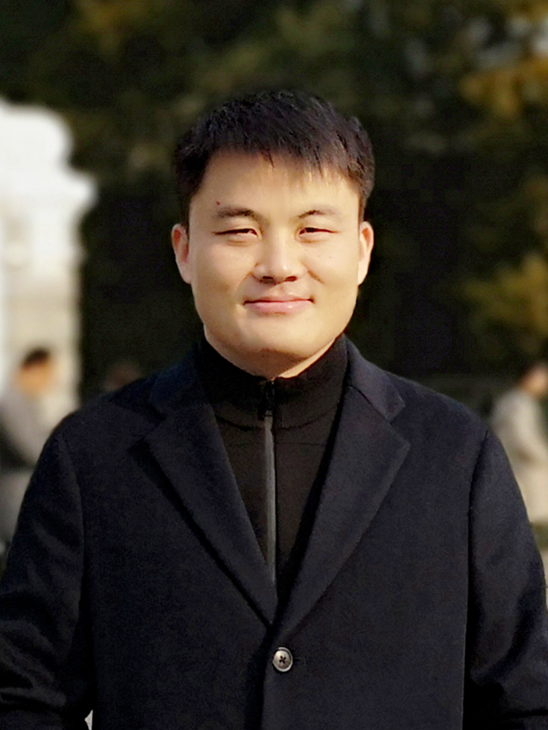

## 新生寄语
### 软件21班主任兼年级主任  徐枫

 

**亲爱的软件学院2字班同学们，**

首先恭喜同学们顺利完成了高中学业，步入大学校门，即将开启全新的大学生活！说到大学生活，相信同学们一定对她既充满了期待，也感到疑惑。大学生活到底是怎样的？大学对我的人生意味着什么？我能否适应大学的生活，特别是在清华的生活？一个一个问题可能会涌上同学们的心头。不过，请同学们不要着急，在今后四年的时光里，老师将和同学们一起，探寻这些问题的答案！

大学的“学”字告诉我们，学习在大学里仍然是最为重要的一件事情，也是同学们疑惑最多的事情。清华里都是全国的尖子，学习压力自然很大，可能很快同学们就会发现，周围的同学可能在有些方面比你更强，或者比你起步更早，你的成绩可能短期内无法像高中那样达到一个很高的水平。这种情况下，希望同学们一定要调整好心态，我们可以比，可以竞争，但最重要的是告诉自己，要跟自己比，跟自己竞争；要关心的是自己的学习状态是否良好，学习方法是否有效，是否在学习的过程中不断获取到了新的知识，培养了新的能力。只要做到了这些，同学们大可不必为成绩和名次焦虑，保持这样的状态，必然有很好的结果；反过来，如果没有这样的状态，就要及时调整，有时尽管当前的成绩还算可以，未来也会有比较大的风险。

除了压力的管理，心态的调整，学习方法到了大学可能也要发生转变。高中时代，同学们可能会对知识点进行反复的练习，深入的探讨；而到了大学，教学的速度会大幅加快，一堂课会有比以前多很多倍的教学内容，课堂上也没有太多的时间帮同学们加强巩固。这就要求同学们要提高自学能力和自学的积极性，包括课前预习，课后复习等。同时，由于大学的学习环境与高中会有很大的变化，同学们不在父母身边，少了最直接的督促。这里，给大家的一个建议是希望同学们尽量要求自己去自习室、图书馆等公共场所学习，相比宿舍，会有更高的学习效率。

说了这么多关于学习的事情，也跟同学们谈谈生活。为什么不把生活作为重点？是因为在大学里，生活有了更多的自由空间，在不影响学习的前提下，大家有了各种各样的选择，这些都没有对错好坏之分。有的同学把很多精力放到了兴趣爱好上，在社团或科创方面实现了自己的价值；有些同学投身社工，在学生会、团委发光发热；也有的同学收获了自己的爱情。我觉得这些都是好的，只希望同学们能够从本心出发，在不断的尝试和体验中，探索自己的道路。回到最初的问题，大学生活到底是怎样的？其实大学生活是多种多样的，需要的是你去探索一条属于自己的道路。

最后是对同学们的一点祝愿：祝愿同学们能够尽快适应大学生活，并走出自己的道路，走出一条专属于自己的灿烂而又有意义的道路。

### 软件22班主任  苗欣
 

**亲爱的同学们：**

大家好！云天收夏色，木叶动秋声。在这景色宜人的秋天里，欢迎大家来到美丽的清华园。我们的每位同学都是来自各省、各中学的佼佼者，从激烈的竞争中脱颖而出，才共同相聚在清华大学软件学院。此时此刻，相信大家既心怀着对未来、对学院的无限憧憬，又肩负着父母殷切的期望和自身成功成才的压力。

当今社会，“内卷”似乎已成为所有人的困局。知乎上永远不缺清华的同学们去吐槽身边的各种“内卷”。我想，这大概是因为在我们清华同学身上，优秀已成为一种习惯，所以需要在每个环节都“卷”赢其他人而获得成功。

然而，教育“不是把水灌满，而是把火点燃”。相比于同学们为了大作业、推研、毕设、出国而随波逐流地拼命，我们更希望同学们能够通过大学学习点燃心中的火把，明确自己的追求和发展方向。于大家而言，成功应该有着更为多元化的定义：在毕业季手握名校offer、被互联网大厂高薪聘请固然是成功，做出能用、好用、管用的软件也是学院所期待的成功。

正如在《明朝那些事中》，作者当年明月所说，成功就是“按照自己的方式，去度过人生”。祝愿大家在四年的大学生活中，能尽早树立自己的理想，沿着自己喜欢的道路，充实地度过人生中最美好的时光！

### 软件23班主任  沈恩亚
 

**一颗“土豆”的出发**

亲爱的同学们，你们好，我是沈恩亚，很高兴能够作为一位班主任，陪伴你们度过未来的大学时光。今年5月学院发布新生班主任招募事宜，我便报名了，从得到通知可以成为你们的班主任后，每每睡不着时，都会想起刚刚踏入大学校园的自己、同学和当年的班主任。想到各种各样的故事和思考想和你们分享，就像和当年的自己分享一样。因此，学院委托我为二字班的同学写寄语，我毫不犹豫就答应了。

你们也许已经收到了许多的祝福，来自父母、同学、亲戚、朋友、邻居……我也要祝贺你们经历了高考和层层选拔，来到了清华园，成为这个园子新的一员。祝福的话语有很多，不过我们就说到这里吧。因为还有一句话，我更想和你们分享，那便是：让自己成为一颗“土豆”，从这里出发吧。

来到园子，你会发现，同学们都很厉害，有省状元、有奥赛金牌获得者、还有已经在某一领域有所建树的“小牛”，其实，这些很重要，也没那么重要，重要的是你也很厉害。踏入园子的那一刻，不管你们来自哪里，取得过怎样的成就，你们都将从“做题家”成为园子里新的“土豆”，普通而又特别，不再有“独木桥”式的竞争，有了更多的选择。重要的是在经历大学时光之后，你会成为一个初露锋芒的学者准备继续深造？还是手握核心技术准备通过创业改变世界？抑或是到大厂去、到乡村去……通过自己的双手，让自己、让身边更加美好？

那么，你的梦想是什么呢？有的同学已经有了明确的人生目标，恭喜你，向着目标奔跑吧。有的同学也许之前想的更多的是把高考考好再说，至于人生目标，还无暇顾及，没有关系，借着新生军训时光，好好想一想，确定一个目标，人生的，或者至少是四年之后的。有了或长或短的目标，也许大学里的一次得失也就没有那么重要，一次考试成绩没有达到目标？一次竞选中落选？向心仪的对象表白暂时没有成功？从大学四年甚至人生目标的跨度去看待某一次得失，也许你会释然，释然不是“躺平”，而是更好的自我反思，向考的好的同学、竞选成功的同学、表白成功的同学取经，下一次“要成功”，直到实现你的目标。

还有一个问题想要考考你们~，那就是园子食堂里有多少种菜是由土豆做成的呢？希望你们大学毕业时能够有答案，也能够尝个遍。至今，我还记得我的导师讲起他年轻时用土豆做一桌子菜招待外国人，学习EDA技术后回国参与开创我国电路板设计方向和研制“银河”超级计算机的故事。我也还记得在大学毕业前，有一天特地早起，围着学校的围墙走了一圈，发现许多未曾注意的“景点”。也希望你们在大学时光里，能够走遍园子的每个角落，尝遍美食，发现更多的美。

最后，还有一个问题~那就是你现在认识了多少新同学了呢？同寝室的、同班的或是一起上课的……你们接下来将有机会一起度过人生中最精彩的四年时光，收获最宝贵的友谊。记得大学毕业时，我最后一批离校，之前送了许多的同学离校，会看到有的男同学送别时哭成了“泪人”，当时甚是不解，觉得来日方长，总会再见。十几年过去了，没想到当年火车发出前透过车窗看的一眼，已未再见，甚至有的同学成为了最后一眼。

亲爱的同学们，我似乎超字数了~，就写到这里吧，有机会再和你们分享。其实，我分享的并不重要，“行胜于言”，重要的是四年之后，你们回望自己大学里脚踏实地走过的每一天，都成就了更好的自己，踏出校园的那一刻，怀揣着自己的理想，走向更大的舞台。也请记得，不管是在大学里，还是毕业后，不管碰到什么问题或挑战，你们的班主任都在这里~

你们的新朋友：沈恩亚
2022年8月8日于清华园

### 2022级本科生带班辅导员：黄舒炜
 

**亲爱的二字班的同学们：**

你们好！欢迎你们加入清华大学软件学院，这是一个优秀、温暖的集体。相信刚来到园子里的你们，对未来的大学生活充满了憧憬，又或者有那么一丝迷茫，我很荣幸能作为大家的辅导员，为大家答疑解惑，陪伴大家度过在清华园里的美好时光。

相信你们在学习上的能力都是出类拔萃的，但大学的学习模式与高中有很大的不同，希望你们能稳扎稳打，努力适应新的模式，永远保有对学习的热情。在课余活动上，大学生活比高中更加丰富多彩：有丰富的社团，有一二九合唱、学生节，还有马杯各项体育赛事……希望你们能够找到属于你们自己的舞台，展现自己的风采，并从中收获乐趣、成长。

在清华，你们拥有许许多多的机会，要勇于尝试发掘自己的各种可能，寻找到适合自己的发展方向。不要拘泥于传统的评价体系、与他人的比较，不要困扰于别人对你的评价，你的努力都会最终展现在你的身上，更多的应该是关注自己的成长和进步。牢记“自强不息，厚德载物”的校训，奋发图强、严以律己、踏实肯干，同时要理性面对成功与失败，不因成功自满，更不要害怕失败、被失败打倒，要相信自己的能力，对自己永远充满信心。

清华很大，给了大家无限的可能，能够包容、实现你的各种梦想，希望大家能够把握好机会，在清华度过一段精彩、丰富的青春时光，找到自己内心的热爱，丰富自己的人生篇章。

### 2022级本科生带班辅导员：符景州
 

**亲爱的软件二字班同学们：**

你们好！我是你们的辅导员符景洲。 欢迎你们来到清华大学，也欢迎你们来到软件学院。在各位的大学生活开始之际，我最想说的是：要多与他人交流。在课程的学习中，收获丰富知识的同时，大家也难免会遇到各种困惑，甚至会被一些挑战性的课程内容所难倒。但不必担心，任课老师和助教会热情地为大家解答问题，身边的同学也都是可以虚心请教的对象。学中问，问中学。在初次接触社会工作时，大家会在服务同学的同时得到锻炼，但也会因为不熟悉的任务而手忙脚乱、不知所措。与其一个人抓耳挠腮，不妨大方地向富有经验的学长学姐寻求帮助，互相学习，共同成长。迷茫的时候，也许与同学、辅导员或老师的一番谈话就能使你豁然开朗；当看清前行的方向后，大可和其他同学交流分享，既为他人指点迷津，更能找到志同道合的伙伴。在这里也许你无法全知全能，但在和他人交流学习的过程中，你一定能成为独当一面的人。
