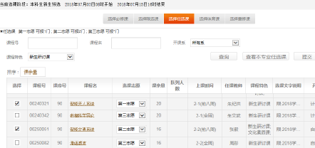

## 选课

### 一、选课时间和阶段（预选、抽签、掉课、补退选、中期退课）

> 不同于小学中学课程由学校同一安排，在清华每位学生每学期的课程都要在学期前自己选择。下面将结合选课的流程与一些软院同学相关的常见问题为大家简要介绍“选课”这一大学中的新鲜事物。

#### 选课时间和阶段：

1. **选课报名阶段**（或称**预选**）：预选通常安排在学期第13-14周，报名采取填报志愿的方式，报名人数不受课容量的限制。在报名期间，网上会定时发布各门课程的志愿填报情况统计，同学们可据此合理调整不同课程的志愿等级。

2. **选课调整阶段**：选课调整阶段分三次进行，分别称为正选（第14-15周）、补退选第一阶段（新学期第1周）、补退选第二阶段（新学期第2周）。正选和补退选第一阶段均采用课容量范围内先选先得的方式，选满后实行WaitingList方案（详见本科生学习指南）；补退选第二阶段不可选课，只可删除已选课程（本科生体育课不可删），所选课程不记录在成绩单上。

3. **退课阶段**：退课阶段分两次进行，所退课程在成绩单上记载W（Withdrew）。退课第一阶段通常安排在第6周，本科生体育课不可退课，其他课程均可退课；退课第二阶段通常安排在第10-11周，本科生体育课和前八周已结束课程不可退课。后八周开设课程的退课不记录“W”。

#### 本科新生选课须知：

新生入学后第一次预选（时间一般安排在军训期间）只设一个志愿等级（即可视为不需填报志愿）。报名人数不受课程容量限制，预选结束后，对于报名人数超过课容量的课程，由选课系统进行抽签，学生可在规定时间通过选课界面的【一级课表】查看抽签结果。之后同学们也可在正式开学一周后的补退选阶段对课程进行调整。

由于选课学分限制规则，同学们大一时每学期最多选择26学分的课程。如确有特殊原因需要超过学分限制选课的，可在网上申请特批学分，由学生所在班级的班主任审批通过后，方可继续选课。

### 二、课程体系

培养方案中的课程体系由校级通识教育课程、专业教育课程两部分构成。全部课程和教学活动按属性分为必修、限选和任选三类。其中，必修课是必须修读的课程，限选课和任选课是限制在若干门课中选择一门或几门课程达到学分要求。这三种课程属性的课程在选课时的志愿优先级递减，并可以分别设置志愿。另外，本科生每学期可选择一门原来以等级制（A+ 至 F 形式）记载的任选课成绩改为以 P/F 形式记载，须由学生本人于课程修读学期第六周在网上进行选择。

**校级通识课程**包括军训、思政、体育、外语、写作与沟通、通识选修课（国际和港澳台学生略有不同，具体见培养方案）。

**专业教育**由基础课程、专业主修课程、夏季学期课程和实践实习以及综合论文训练组成，由所在院系负责规划和实施。夏季学期课程和实践实习包括基础技能训练、专题研究训练、专业实习实践等。

### 三、体育课程

清华历来有重视体育的优良传统。第 1-4 学期的体育 (1)-(4) 为必修，每学期 1 学分；第 5-8 学期的体育专项不设学分，其中第 5-6 学期为限选，第 7-8 学期为任选。学生大三结束申请推荐免试攻读研究生需完成第1-4 学期的体育必修课程并取得学分。

对于因为身体原因选无法完成当学期体育课的同学，可以选体疗课程进行替代，或退课在后续学期补上课程。需要注意的是，如果选择体疗课，则至多得到60分（对应等级D），因此同学们要慎重选择。

从 2017 级起，学校恢复了“不会游泳不予毕业”的老校规。不会游泳的同学要在专业教师指导下练习，争取及早通过学校定期组织的测试。

体育课的选课、退课及境外交换学生的体育课程认定等详见《清华大学本 科体育课程的有关规定及要求》

### 四、选课系统与机制

1.进入“清华大学教学门户”主页面，网址为：[http://academic.tsinghua.edu.cn](http://academic.tsinghua.edu.cn)，选择【进入选课】

2.点击【选课操作】-【一级选课】/【二级选课】/【退课】
3.【一级选课】

选课界面上部分为待选课程，由“选择必修课”、“选择限选课”、“选择任选课”、“选择体育课”和“选择重修课”五个Tab 页组成，学生可切换页面进行选课；下部分为已选定课程。拖动中间的分隔线可调整窗口大小。选课框下方显示了已选择学分（大一秋季限制26学分）

**必修课、限选课、任选课的选课**

在“必修课”和“限选课”页面，已分别列出了本学期教学计划安排的必修课和限选课。

在“任选课”页面，可查看本专业任选课，还可从“课程特色”中选择文化素质核心课、新生研讨课、公共英语、通识英语等选项查询相关课程信息。

在课程列表左侧的选择框中勾选希望选修的课程；在选课报名阶段还要在该课程的“选课志愿”中选择志愿等级，即填报选课志愿，再点击【提交】按钮选课。

选课【提交】后，系统会对勾选的课程进行上课时间冲突、考试时间冲突、选课限制条件、选课优先条件等检测。检测合格则选课成功；检测不合格则选课失败，界面右下角会弹出提示窗口，显示失败原因。

**体育课的选课**

在“选择体育课”页面，可先通过页面提供的模糊查询条件调出课程。例如：在“课程名”中输入“一年级男生”，点击【查询】按钮，即可查看所有一年级男生体育课。在选课报名阶段，体育课允许填报同一门课程的不同课序号，但限定每人每学期只能选中一门当学期体育课。

**删除课程**

若希望删除已选定的课程，请在“已选定课程”列表的“是否删除”中选择要删除的课程，确认无误后点击【删除】按钮即可。学生可在“选课无效信息”中查看自己的删除课程操作。

**查询选课抽签结果**

抽签结果结束后，可以通过【选课查询】- 【队列信息查询】查看自己是否有课程未选上而进入队列。

4.【二级选课】

在开课信息的“是否二级选课”项中标识为“是”的课程（主要是含有实验或习题的课程），在进行一级选课后，还需在二级选课中挑选实验时间和实验项目。二级选课采取先选先得方式进行，二级选课不判断与一级选课的时间冲突。

5.【课表查询】

选课完成后，可通过功能菜单中的【课表查询】项，查看已选课程的一级课表、二级课表以及合并后的整体课表。

一级课表可选择以二维课表方式显示或以列表方式显示。在二维课表中显示“已安排上课时间的课程”，二维课表下的课程”。

整体课表是将一级选课和二级选课的所有已选课程、实验整合在一张课表中，二级实验课程为蓝字显示。

6.【网上退课】

在网上退课期间，点击功能菜单中的【退课】项，即可进入退课界面。从“已选课程”列表中选择要退的课程，确认无误后点击【退课】按钮，则该课程列入下方的“已退课程”中。

### 五、常见问题Q&A

>  1.大一选计算机系的课程和软院的课程有什么区别（程设、离散等）

对大一下学期的分流和大学毕业培养方案的完成没有影响，课程编号也是完全一样的；但是还是有些许不同：

1. 在授课内容上，因为开课院系不同，老师会在课程中加入一些具有院系和个人的特点的元素

2. 在作业的内容、数量、难度上均有所不同

3. 在考试上，通常不统考，给分情况也不同

以上的不同，感兴趣的同学可以具体询问学长学姐。

> 2.英语课程相关问题

英语教学的现行方案实施自 2019 级学生，可以在教学门户上搜索方案原文。

**英语分级考试：**

在入学时，学校会组织大家进行英语分级测试，分为最高四级到最低一级。（往年软院平均约为3级左右）

**英语基础课组：**

根据不同的入学分级需要选取不同难度的英语基础课程（阅读写作、听说交流）。高级别的英语基础课程可以替代对应的低级别课程。四级可以免修英语阅读写作，经过入学考试的加试可以免修听说交流。

各种学科专业课（如微积分、线性代数、高等线性代数选讲、大学物理）有全英文版的课程，绝大多数都是可以进入培养方案，具体可以咨询院系教务老师。但是教学内容、考试难度、给分情况均与中文课程有所不同。分级在 3/4 级别的同学，修读每两门外文认定课、全英文课程，可以免除一门英语基础课程。

**英语提高课组：**

英语提高课组由三部分组成：第二外语课组，外国语言文化科组、外语专项提高课组。所有学生需要在这三个课组中总共修满至少四个学分以完成培养方案。一般来说，第二外语课组的课程都是 4 分，所以同学们在选择英语提高课组时应首先决定是否要选择第二外语课组中的课程。

英语提高课组是学校中最为抢手的课组之一，建议同学们在大学四年中提早开始选修相关课程。英语提高课组在课程设置上与英语综合能力科组没有先后顺序，只要能力足够，同学们也可以先修英语提高课组。

**请注意，以上全英语课程政策请一定在选课前咨询院系教务老师。**

> 3.选课学分限制是多余的吗？

大一学年的选课限制是 26 学分。刚刚进入大学的同学可能觉得选完必修就剩下两三个学分实在有点少；但根据学长学姐们的经验来看，26 个学分是比较合理的限制，能够给同学们充足的学分。也可以在选课系统内申请特批学分，并在申请后联系班主任审批来突破学分限制。

> 4.通识选修课怎么学？

通识选修课分为四个课组：科学、社科、艺术、人文

四个课组总共需要修习 11 学分，每个课组至少需要修习 2 学分。具体的课组情况可以在选课手册上或进入选课系统、info-培养方案界面查看。

值得提到的是，任何带有通识选修的课程是不能够记 PF 的，即使他们在选课时为“任选”。

> 5.记 PF 是什么？

每学期可以在课程属性是任选的课程中任选一门记作 PF 。

注意：选课属性和课程属性不相同，课程属性是任选的课程包括：不以任何方式计入培养方案的课程；部分辅修学位课程。

> 6.我期中考的不太好，到底要不要选择中期退课？

第六周、第十周退课会在成绩单上计 W ，有一定可能会对之后产生较小的影响。此外，必修课的退课也可能导致大二、大三课业压力更加繁重。

如果预估自己可能挂科或者预估自己可能获得严重低于自己预期分数的成绩，可以选择中期退课，总体来说影响会比挂科或者某门课获得很低的绩点小。

> 7.港澳台生和国际生关注相关的军训、思政课等选修政策

港澳台生和国际生有不同的军训和思政课制度，详情可以询问辅导员。