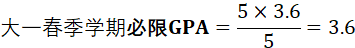
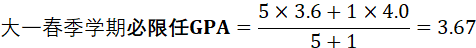
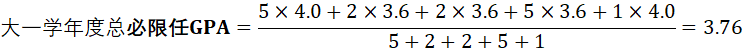

## 学分绩

### 一、GPA计算方法

 GPA（平均学分绩）是我们在大学期间年级排名的参考依据。每年春季学期末，院系会根据同学们本学年度的GPA从高到低进行排名。其计算方法如下：
$$
GPA=(\sum \text{课程学分}\times\text{课程绩点})/\sum\text{课程学分}
$$

注：

1. PF课程（即在成绩单上记录为N/A的课程）不计入GPA的计算。
2. 每学年度的排名分为**必限课程排名**和**必限任课程排名**，二者在GPA计算上略有区别。**必限课程排名**的GPA计算公式中的课程学分只包括【必修课程&限选课程】，而**必限任课程排名**的GPA计算公式中的课程学分则包括【必修课程&限选课程&任选课程】。

例：

软小宣在大一秋季学期和大一春季学期参加的课程如下：

| 课程名称 | 微积分A1 | 机器学习 | 英语阅读写作 |
| -------- | -------- | -------- | ------------ |
| 课程属性 | 必修     | 限选     | 任选         |
| 课程学分 | 5        | 2        | 2            |
| 绩点     | 4.0      | 3.6      | 3.6          |

| 课程名称 | 微积分A2 | 学生社会工作概论 | 党的知识概论 |
| -------- | -------- | ---------------- | ------------ |
| 课程属性 | 必修     | 限选             | 任选(P/F课)  |
| 课程学分 | 5        | 1                | 1            |
| 绩点     | 3.6      | 4.0              | N/A          |

### 二、GPA影响及重要性

GPA是大学期间成绩展示的指标，在奖学金评定、个人简历乃至未来的保研、出国申请中都是极为重要的成绩依据。

尤其在入学的第一年，大学一年级的GPA在四年的大学生涯中尤为关键。在课程设置方面，由于大学与高中的授课模式差异很大，外加大一的基础课程（微积分、线性代数、高等代数、大学物理等）难度较大并且课程学分较高，一旦考出不理想的绩点，后面再弥补就更加困难；个人发展方面，大一学年的GPA是新生后续参加各种校级培养计划、学生组织、奖学金评定的重要依据，一个较好的GPA会对未来的发展有很大帮助。请同学们多加重视，打好基础~

### 三、GPA的严肃性

我们鼓励大家公平竞争、共同进步，但一定要遵守原则底线，**切忌抄袭作弊**！！！在清华大学，**学术不端的后果极其严重：通报批评、休学以及退学**。请同学们不要抱有侥幸心理，严格恪守学术底线。

> 关于退课：

在学期中，如果大家感觉某门课程上起来过于吃力，或者期中成绩远低于自己的预期，可以考虑合理退课。建议同学们在退课前慎重思考，尽量避免退**必限属性**的课程，**与辅导员及时交流**想法和自身情况。

同时，我们不希望大家一门心思卷GPA。GPA虽然重要，但它**绝不是**大学生活的全部。大学不是高中的升级版，希望同学们在课余时间多探索校园，参加各种学生组织、校园活动、学术竞赛，相信园子里有无数精彩的内容等待你去发现呀~