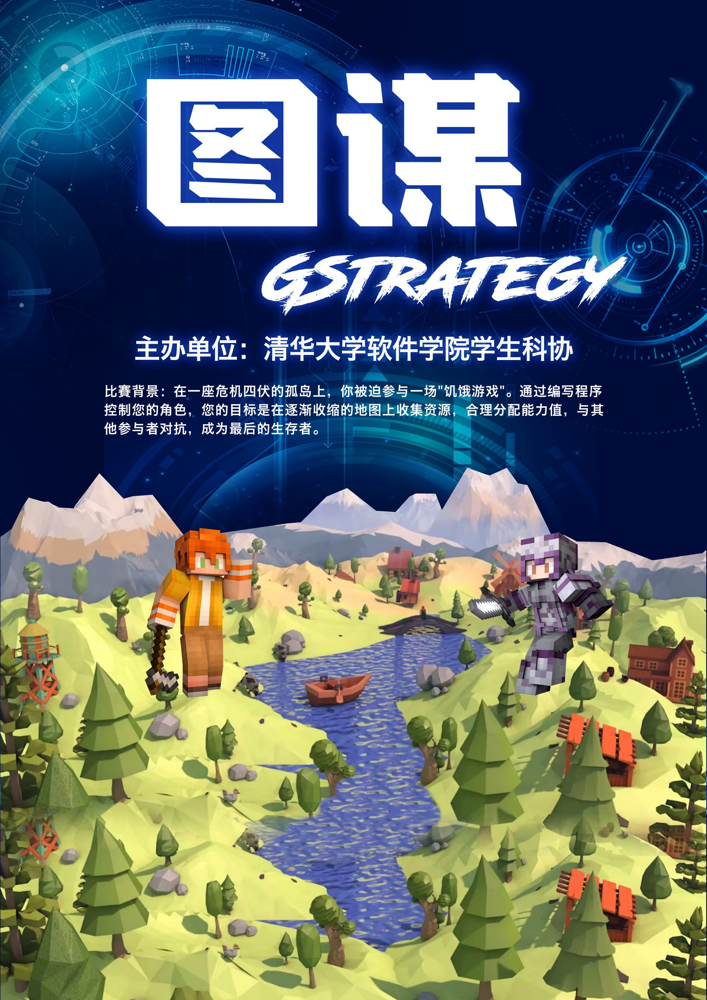

## 课外科创赛事体系

### 1.科创支持

**a. 星火计划**

“星火计划”全称为“科技创新，星火燎原”清华大学学生创新人才培养计划，是由学生处、教务处、校团委联合发起的因材施教计划，旨在培养具有学术志趣、首创精神、跨学科视野的拔尖创新人才。“星火计划”培养期为两年，将围绕前沿讲座、学术讨论、自主立项、产业调研、海外研修五个基本培养环节，为学员提供重点行业领域参访、跨专业学术交流、创新思维与创新方法讲座、国内外学术科技竞赛支持等丰富资源。该计划仅面向大二上同学。报名时间为每年12月左右。

往届星火计划成员经验分享见网址[经验分享 - ReadMe 软件学院互助文档 (ssast-readme.github.io)](https://ssast-readme.github.io/innovation/star/share/)。

**b. 学推计划**

全称为清华大学“大学生学术研究推进计划”，是清华大学学生拔尖创新人才“全过程累进支持、全方面匹配资源”培养体系的重要组成部分。学推计划要求学生根据自身学术志趣，自主设立研究项目，学校匹配项目经费，通过项目管理体系以及学术交流平台培育扎实的科研功底和学术创新能力。学推计划鼓励跨专业、跨学科的交叉研究项目，支持申请人关注国家战略需求和科研重点难点问题，不断探索前沿科技领域。报名时间为每年3月左右。

**c.闯世界计划**

为提升学生学术创新能力、培养具备全球胜任力的拔尖创新人才，学校于2012年起面向全校本科生开展本科生海外学术研修支持计划（简称“闯世界”计划），为学生参与海外学术研究提供经费支持。支持优秀本科生根据自身兴趣自主联络研修机构、确定研修课题及计划、开展暑期学术研究。报名时间为每年4月左右。

### 2. 科创培养

**a. SRT**

SRT的全称为Students Research Training，即大学生研究训练计划，是学校为了鼓励本科生参加科研、提升本科生学术创新能力、接触具体实践、认识所在行业科研状况而实行的方案。每学年共有2次SRT报名机会，分别在春/秋季学期的5-6周。SRT的选题多数由老师确定，大一到大三年级同学也可以选择自主立项。在项目中，学校会提供一定的科研经费，老师提供指导，同学完成核心研究工作。自行立项的同学需要根据项目邀请相应老师指导。报名时间为秋/春季学期第六周左右。

**b. SSRT**

SSRT是清华大学软件学院本科生专属的学生科学研究训练计划，也可以看作“软院专属的SRT”。它创造了一种开放式的项目训练模式，让由学生自发组成的科研团队在项目导师的专业指导下，在真实的科研环境中体验科研过程、探索科研方法、锻炼科研思维。SSRT计划整合了全院开放的科研项目资源，为大一到大三的全体本科生提供多方向的科研项目、全方位的科研体验和导师的深入指导。报名时间为每年5月左右。（图为2021年秋季学期SSRT计划中期沙龙）

**c. 挑战杯** 

清华大学“挑战杯”学生课外学术科技作品竞赛是由清华大学教务处、科研院、研究生院、校团委和校学生科协共同主办的全校性学生课外学术科技作品竞赛，目前已举办了四十届，是清华大学规模最大、历史最长、水平最高、最具影响力的学生课外科技赛事。申报参赛的作品分为自然科学类学术论文、哲学社会科学类社会调查报告和学术论文、科技发明制作三大类型。报名时间为每年11月左右。（图为2022年第四十届“挑战杯”校科展现场，软件学院获奖选手与科协工作人员合影）

### 3. 学生科技赛事

**a. 图·谋**
GStrategy（图·谋）游戏竞赛是由清华大学软件学院学生科协主办的，主要面向低年级同学的编程游戏竞赛。竞赛的主要目的，是希望在确保C/C++编程应用趣味性的同时，让同学们通过设计游戏策略的形式，深入理解、熟练应用图论算法知识，在竞争中提高编程能力，并收获解决实际问题的成就感。报名时间为每年3月左右。

   

**b. 软件创新创意大赛**

清华大学软件创新创意大赛是由清华大学软件学院学生科协主办，面向全校软件开发爱好者的趣味比赛。比赛分为两个赛道：创意赛道和开发赛道，分别关注软件的创新设计、软件的开发应用。在两个赛道中，参与选手将分别模拟实际开发项目中的“甲方”和“乙方”。比赛重点考察同学们的设计创新能力和实际动手能力。报名时间为每年8月左右。

   

**c. 兴趣团队**

清华大学学生科技兴趣团队以培养学生科研兴趣和探索精神为出发点，引入国内外优质企业资源，跨学科跨年级组建的科技创新类研究团队。目前在册团队24支，现有成员900余人，累计完成项目300余项，获得国内外科技比赛奖项67项。以近几年为例，未来汽车兴趣团队获得全国“挑战杯”特等奖、未来智能机器人兴趣团队获得IROS智能机械手操作与控制竞赛第一名、天空工场兴趣团队获得第二十一届全国机器人及人工智能大赛的金奖。报名时间详见各个兴趣团队的招募时间。