## 课外体育

### 室内场所

+ 气膜馆

  + 羽毛球
  + 乒乓球

  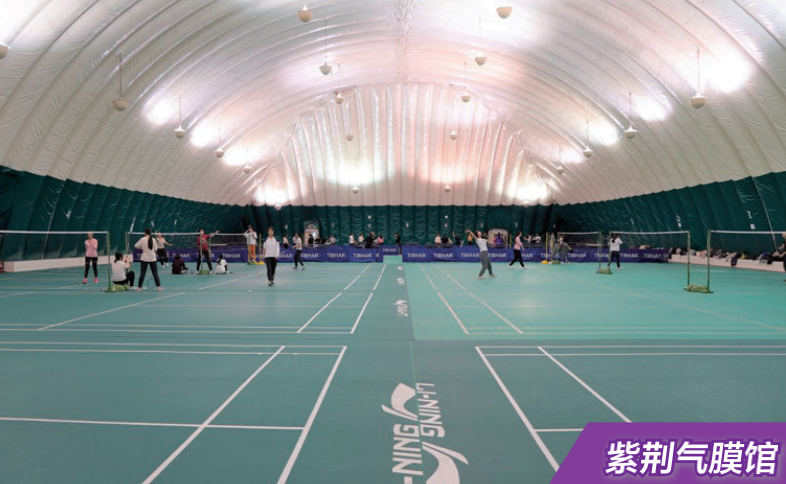

+ 综合体育馆（综体）

  + 篮球
  + 羽毛球
  + 健身房（无需预约）

  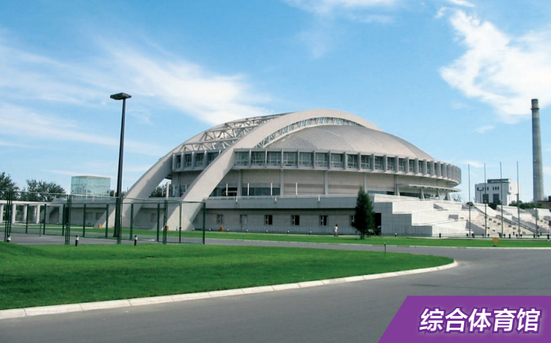

- 西体育馆（西体）

  - 篮球
  - 台球
  - 羽毛球

  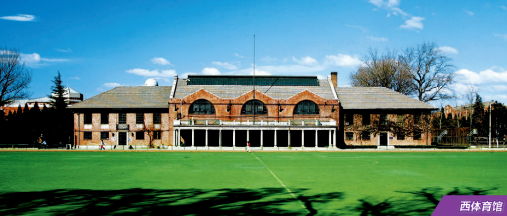

- 陈明游泳馆

  - 游泳池
  - 健身房（从外面上楼梯，二楼进）

  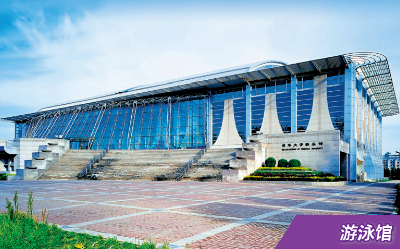

> 注：想要使用室内场所进行体育活动需要提前预约。预约方式：打开info(info.tsinghua.edu.cn) —> 登录 —> 左上角选择综合界面 —> 左侧导航栏中选中校园生活下面的体育场馆预约即可进入预约界面。

### 室外场所

- 北操

  - 足球场（两个七人制场，也是四个五人制场）

  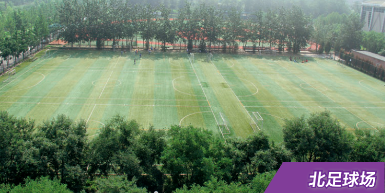

  - 棒/垒球场

  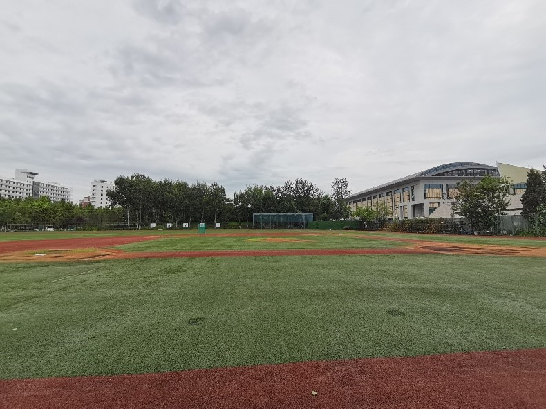

- 紫荆操场

  - 橄榄球场改造操场（一圈不是400米）

  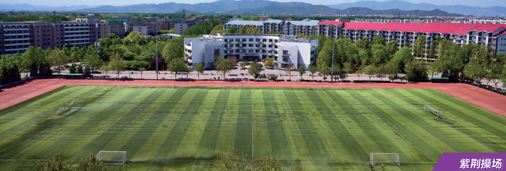

  - 足球场（一个标准十一人制场，也是两个七人制场）
  - 篮球场（七个全场）

  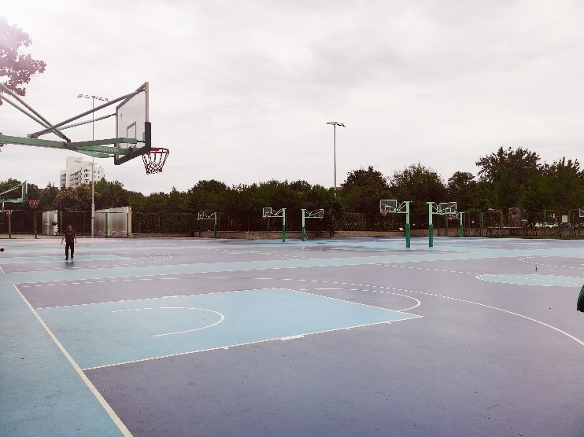

  - 网球场

  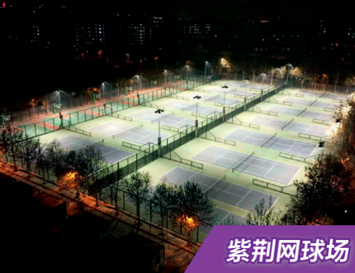

- 东操场

  - 400米标准操场

  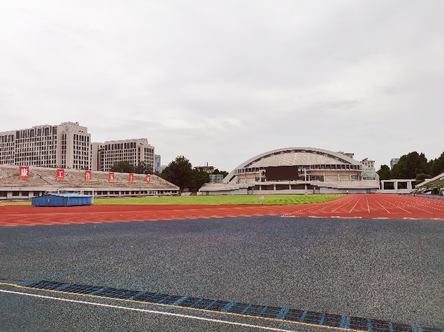

  - 排球场（南北各三个场地）

  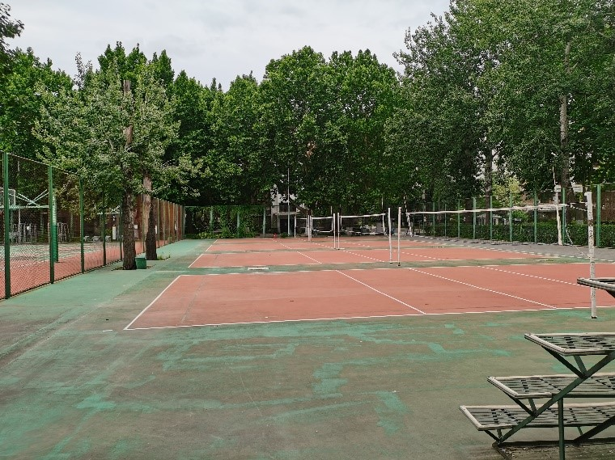

  - 篮球场（南北各三个全场和三个半场）

  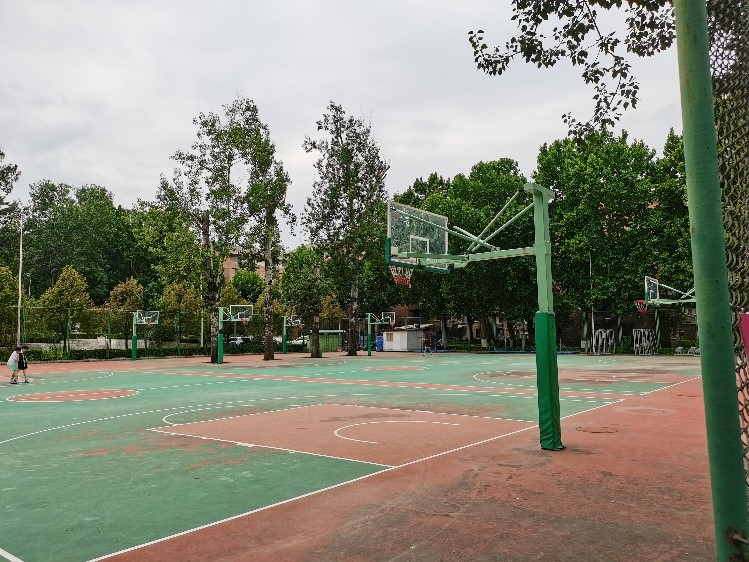

  - 网球场（在综合体育馆东北侧）

  - 轮滑冰球场（在综合体育馆西侧）

  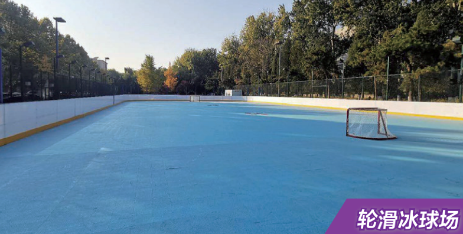

- 西操

  - 400米标准操场

  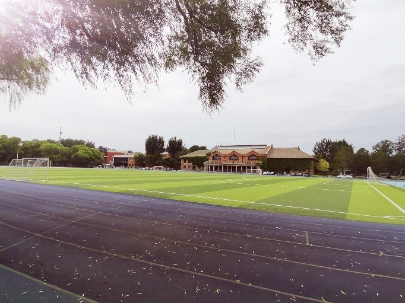

  - 足球场（一个标准十一人制足球场）
  - 网球场
  - 篮球场

- 西湖游泳池

  - 游泳池

  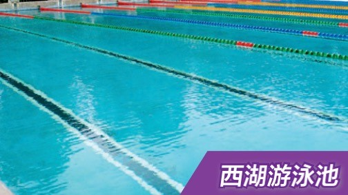

### 院内体育活动

- 足球系内赛

  软件学院足球队在2021-2022学年中的马杯乙组比赛中，上演了一场惊天翻盘，时隔七年再次冲出小组赛。（请看到这里的同学们务必观看b站清软小研发的比赛视频）新的一学年代表着新的气象，希望软件学院足球队今年可以走的更远。同学们也可以期待一下今年的足球系内赛！

- 篮球系内赛

  “呼吸不停，篮球不止”，软件学院学生会体育部会在春季学期开展一年一度的篮球系内赛，为软件学院的同学们提供一个相互认识、相互切磋、相互学习的平台。在去年，篮球系内赛也是改制成为了软件学院篮球嘉年华的一部分，在封校的疫情期间，给大家带来了很多的快乐。因此，同学们可以狠狠的期待一下。

  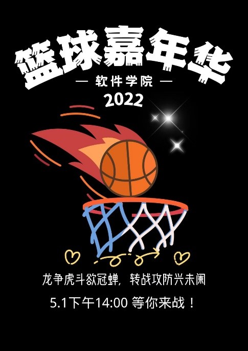

- 排球系内赛

  每年的五月都是运动的季节。在马杯排球比赛刚刚结束的时间段，软件学院都会联合其他院系一同举办“鱼跃杯”排球比赛。“鱼跃杯”排球比赛以娱乐和团建为第一目的，在一天之内结束全部赛程，是一个难得的不管输赢都可以玩的很开心的赛事。同学们敬请期待！

  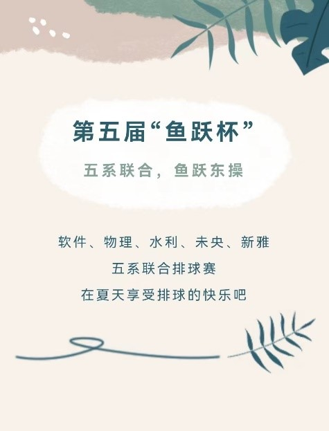

- 假期电竞比赛

  软件学院学生会体育部会在每年寒假的时候举办一年一度的“码”杯电竞比赛。在上个学年（2022年）的寒假中，软件学院学生会体育部联合航院、自动化系、医学院药学院以及法学院的学生会体育部举办了五系联合的电竞比赛，其中开展了王者荣耀、英雄联盟、跳一跳三个不同的赛事，而无一例外的都由软件学院的同学拿下了最终的桂冠。在2022-2023学年的寒假中，电竞比赛将会卷土重来，敬请期待。上届比赛成绩图：

  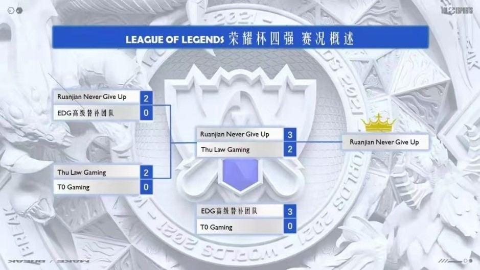

- 待发展中…请关注软件学院微信公众号“软小宣”获取院系内各方面的信息