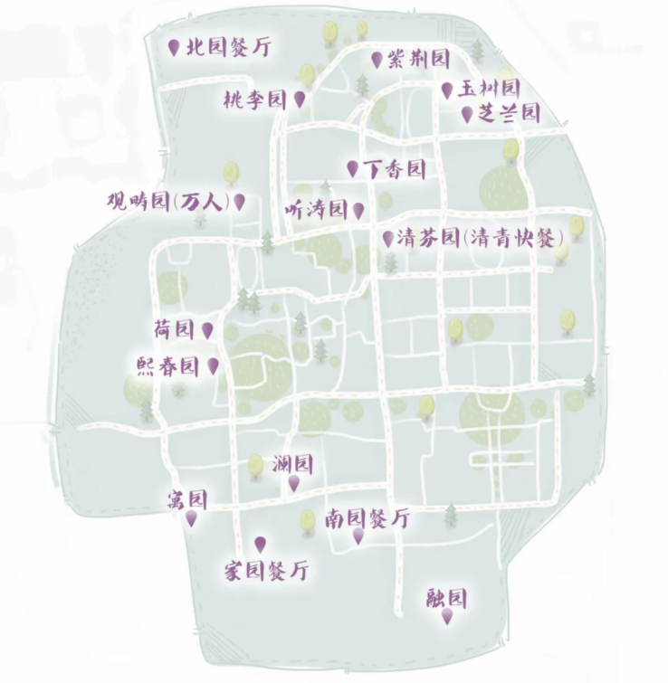
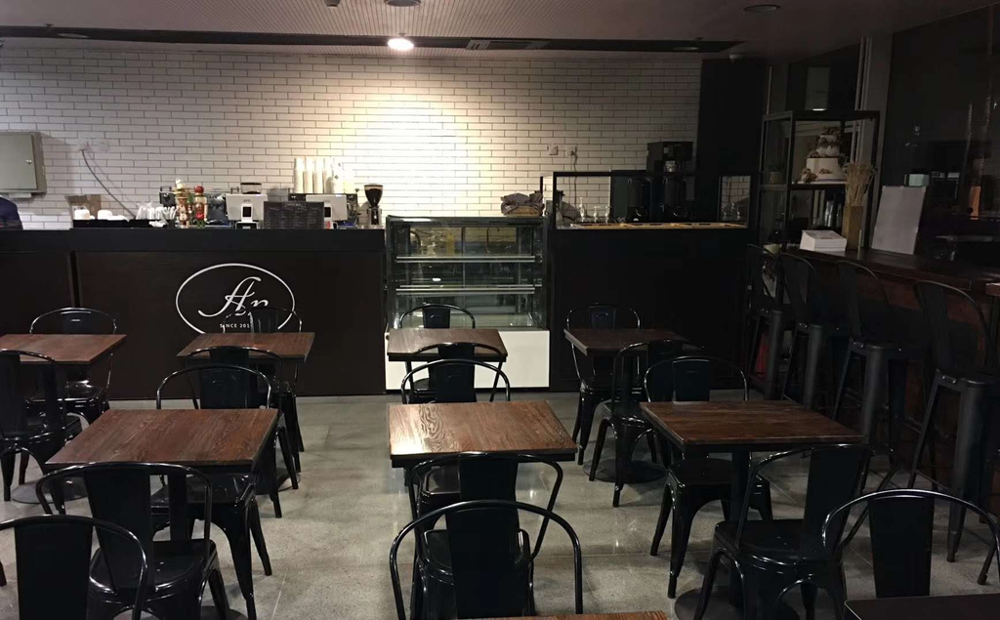
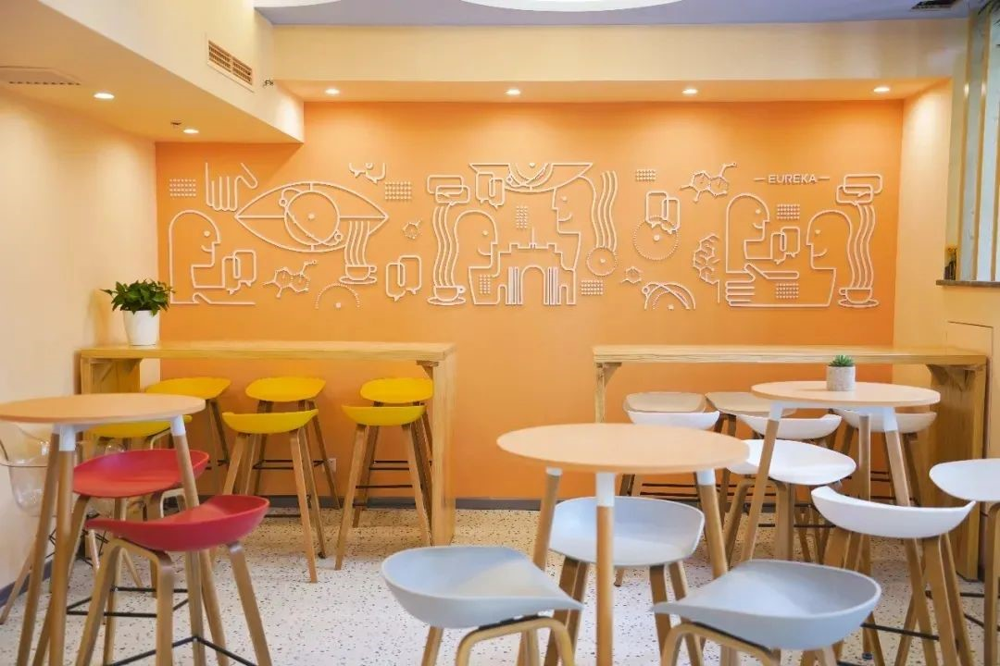
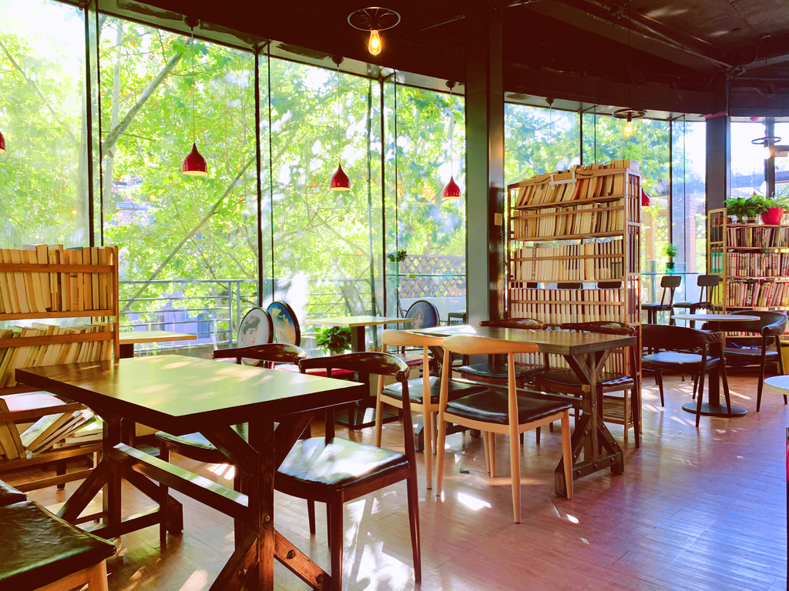

## 衣食住行

### 衣

1. 宿舍楼内每层有洗衣机（每层大约5个洗衣机），6:00到23:00可以使用，用手机扫码即可洗衣，并可用thuinfo app查看洗衣机的占用情况，且建议同学们自备洗衣液。如果需要手洗衣物，可以在盥洗室内接取自来水。
2. 宿舍有阳台和晾衣杆，可以用来晾晒衣物。需要同学们自行携带或购买衣架，圆形衣夹和晾衣绳等，还可在窗台放置晾衣架，但室内的空间可能不足以晾晒衣物。
3. 学校内有干洗店，缝纫店。干洗，修补衣服都十分方便。校内还有多处眼镜店。
4. 如需穿着正装、西装，可以参与开学的新生团购活动，届时团购推送将在软小宣公众号发布，同时校内还有多家租衣店，如清芬园地下，观畴园地下，都可以租借到各式服装。

### 食

#### 1.食堂篇

清华共有16个各具特色的食堂，遍布于校园的各个角落。下面这份食堂地图，对想要吃遍清华食堂的同学来说必不可少。

清华的食堂不仅数量多，质量上也是数一数二，下面就一起来领略主要几个学生食堂的风采吧。

+ **紫荆园**

  紫荆园位于紫荆学生公寓区中央，共有五层。地下一层为清青披萨。一层有各种风味小吃，包括广式风味、东南亚风味。二层为基本大伙，其中海南鸡饭和铁板系列很不错。三层有东北菜、鲁菜、桂林米粉等特色风味。四层有川湘美食，适合口味较重的同学，榴莲酥、烤牛奶等特色点心也很美味。

+ **清芬园**

  清芬园位于紫荆公寓和教学区的中间路段，是上下课的必经之路。清芬园也有四层，地下一层为清青快餐，有各种汉堡套餐，刚出炉的薯条很新鲜，营业时间较晚且可以点外卖。一层有生煎包等小吃以及砂锅面麻辣烫等。二层的烤鸭和麻辣香锅比较推荐。三层为教室食堂，学生一般不能单独进入。

+ **听涛园**

  听涛园位于清芬园对角，有上下两层，一层为各式中餐，有肉夹馍、油泼面等陕西面食和担担面、龙抄手等川渝小吃。二层为清青牛拉。

+ **桃李园**

  桃李园位于紫荆学生公寓区内，共有四层。地下一层为清青休闲餐厅，适合聚餐。一层营业时间较晚，有烤串、烤冷面、炸鸡等小吃，新推出的烧鸟丼很受欢迎。二层为自选菜品，跷脚牛肉味道很好。三层点菜，主营烤鱼系列及云贵风味。

+ **丁香园**

  丁香园位于紫荆一号楼以南，面积不大，但是饭菜可口实惠，烤肉拌饭、瓦罐汤、肠粉都不错。

+ **观畴园**

  观畴园又名“万人食堂”，位于西操北侧，共三层。一层由清青永和、清青咖啡厅、清真餐厅，及四个特色风味小吃窗口组成。二层为自选，菜品十分丰盛。三层点菜，主营川湘、京鲁、粤菜风味。

+ **玉树园**

  玉树园位于紫荆公寓18号楼和19号楼之间，共两层。一层主营川菜、鲁菜、精品家常菜等。二层有石锅铁板等风味快餐，提供夜宵。

+ **芝兰园**

  芝兰园紧挨玉树园，共两层。一层经营伊斯兰风味的自选和点餐，提供包间。二层为清青小火锅。

+ **澜园**

  澜园位于照澜园商业区（清华园社区购物中心二层、三层），二层提供点菜、包间服务。三层提供自选餐和热干面、陕西凉皮等风味小吃。

+ **荷园**

  荷园坐落于蒙民伟楼以南，荷花池畔，共两层，主营特色小吃，各色炒菜，推荐酸菜鱼、秘制樟茶鸭等，二层还配有水吧，可点咖啡果汁等饮品。

+ **北园**

  北园位于北门外的西北小区，主食有各色自制西式小点心，烙饼、烤货、包子、水饺等，特色为酱香猪脚、红烧鳕鱼、红烧狮子头、香脆炸蘑菇等。

#### 2.咖啡奶茶篇

+ 仰望咖啡：李文正馆一层，店面小，环境明亮。联系方式：010-62569770。

+ 安家小厨：文图一层，提供面包、点心等，桌椅较多，适合学习、办公。联系方式：010-62799790。

+ 有理咖：紫荆21号楼2层，联系方式：010-53679353。

+ 1911咖啡：艺术博物馆一层及近春园小岛中央，联系方式：010-62791911（艺博店）、15010971911（荷塘店）。

+ 独峰书院：清华大学李文正图书馆北200米，独峰书院二楼，环境优美，价位适中，自制的曲奇很不错。联系方式：010-62789362。

+ 紫荆书咖：观畴园一层南门，联系方式：13681590153。
+ 蒙楼咖啡：蒙民伟楼一层。
+ 水木三创咖啡：职业发展中心一层，联系方式：15810111369。
+ 拾年咖啡：蒙民伟音乐厅附近，环境优雅，提供饮品、三明治、小食等，均价40元/人。联系电话：010-62798291。
+ 天投咖啡：李兆基一楼。
+ 水木领航咖啡：清芬园东侧。
+ 七港九奶茶：南区7号楼下，营业时间为10：00-22：40，均价17元/人。
+ 果茶屋：桃李园一层，主营果茶、奶茶。
+ 厝内小眷村：观畴园地下，味道不错。

#### 3.水果篇

+ C楼天猫超市：

  优点：距离紫荆宿舍近，种类丰富。

  缺点：质量好坏比较看运气。

+ 网购&外卖：

  优点：选择丰富，经常有优惠。

  缺点：需要配送，不能亲自判断质量。

+ 食堂：

  优点：价格实惠，分量足，可打包。

  缺点：种类较少，质量好坏看运气。

+ 南区水果店：

  优点：水果种类全，环境好。

  缺点：离宿舍比较远。

+ 万人地下超市：

  优点：比较新鲜。

  缺点：离宿舍比较远。

+ 照澜院对面菜市场

  优点：种类丰富。

  缺点：价格较贵。

#### 4.小吃篇

+ 清华酸奶：

  各大食堂均有销售，1.8元/袋。

+ 绿豆冰沙：

  各大食堂均有销售，3元/杯，解暑必备。

+ 桃李夜宵：

  每晚7:00-11:30，炸鸡、米粉等等种类丰富、价格实惠的夜宵等着你！

+ 面包糕点：

  各大食堂、咖啡厅、猫超均有销售，食堂较为便宜，但是没有其他的美味。

+ 烤鸭：

  清芬园二楼有售，7元/盘。

#### 5.其它：

+ 自动售货机：

  紫荆宿舍几乎每单元楼下都配备1-2台售货机，提供饮料、零食。在各教学楼、办公楼也有饮料售货机和咖啡售货机。

+ 饮用水：

  紫荆宿舍每个水房内都有一台超滤净水机，可以满足日常开水需求。也可以向清紫源泉定水，一般在15-25元一桶，纯净水水质差别很小。猫超也有纯净水出售，5L装农夫山泉售价8元/桶。

### 住

1. 紫荆学生宿舍以四人间为单位，相邻的A、B两个四人间有中厅相连。宿舍内有空调和暖气，每层楼的楼道两侧分布有盥洗室和公共淋浴间。宿舍采用“上床下桌”的设置，为同学的学习生活留下了充足的空间。床的尺寸为0.9m*2m（购买床帘蚊帐建议尺寸195cm左右），床板距离天花板约130cm，适合常见的床帘、蚊帐。
2. 活动室：
   1. 紫荆1号楼608是软件学院的活动室。可以扫描宿舍门上的二维码预约使用。
   2. 教室可以通过“学生清华”网页版（[https://student.tsinghua.edu.cn/](https://student.tsinghua.edu.cn/)）中“办公平台”——“活动申请”进行预约。
   3. C楼二层和三层，南区地下空间内有学生活动中心。其中的会议室、研讨间等可通过微信小程序“学生清华”预约。图书馆北馆（李文正馆）及文科馆设置了单人研读间和团体研讨间向全校师生开放，需要通过研读间/研讨间预约系统（[http://cab.hs.lib.tsinghua.edu.cn/](http://cab.hs.lib.tsinghua.edu.cn/)）预约。另外还有环境清雅设施齐全的胜因院（[http://goglobal.tsinghua.edu.cn/cn/syy22](http://goglobal.tsinghua.edu.cn/cn/syy22)）可以预约。
   4. 清华还有一个天然团建活动室——紫荆操场。无论是弹奏、演唱还是桌游，紫操都是一个非常合适的场所，只是要记得晚饭后早些到操场上找好活动区域。

### 行

1. 自行车：学校中主要的交通工具是自行车，在宿舍楼下每个宿舍都设有固定自行车位，希望大家将自己的车辆摆放好。在校内紫荆三号楼，校河旁等设有多处自行车维修点。
2. 电动车：在学生区不允许停放电动车，电动车电池不允许携带到宿舍楼内充电，不允许无证电动车在校内骑行。
3. 校车：校内设有固定路线的校车，可以前往校内多数非住宿、教学区的主干道沿线。具体线路图和时间表可以从微信小程序“清华校园巴士”中获取。