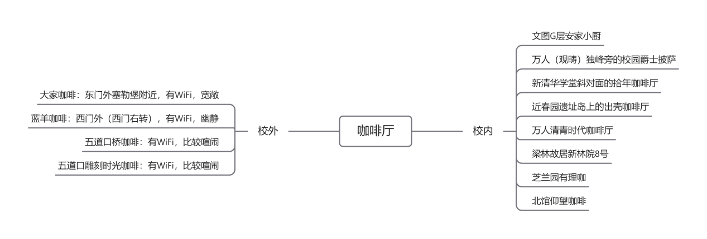
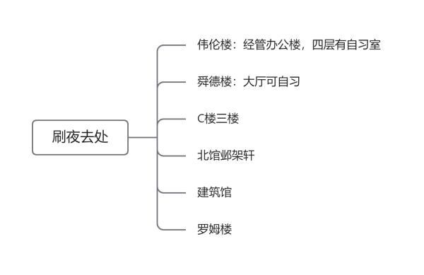
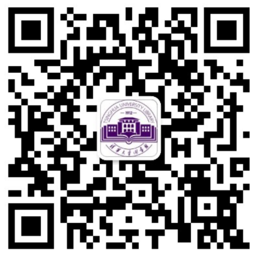
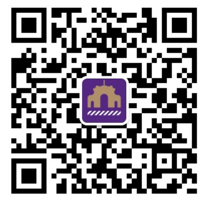
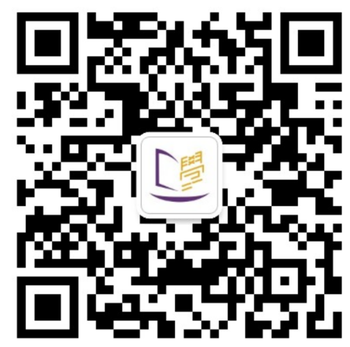
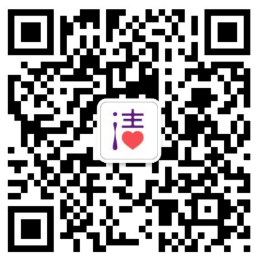
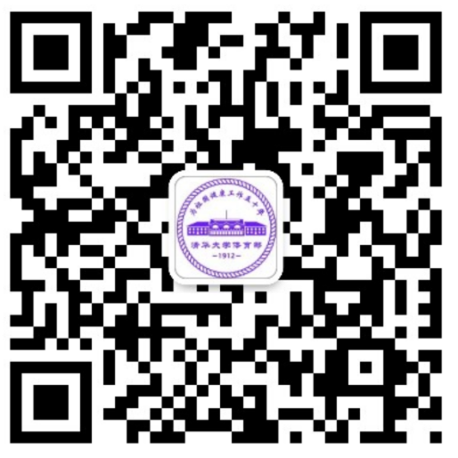
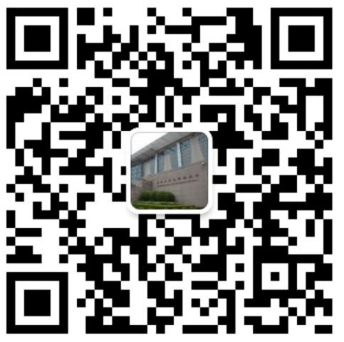
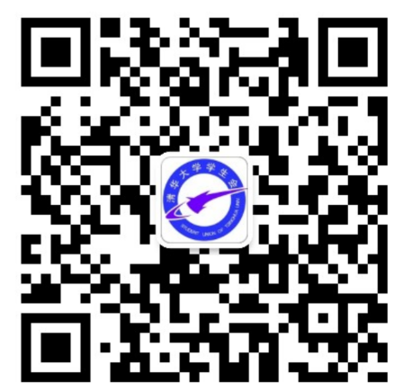
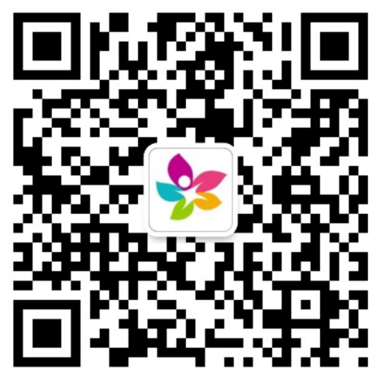

## 学习&书店&实用链接

### 自习场所

#### 一、教学楼

建议先使用At Tsinghua（一款方便清华学习、生活的APP）的“教室推荐”功能查询当前人数，避免无位可坐。此外，Info-学习-教室资源，也可查询特定时间段内教室的使用情况。

1. 清华学堂：古色古香的旧时建筑，有典雅清冷之感，自习的人通常不多，冬天温度偏高，教室内为配套的木制桌椅，桌板偏小，每套桌椅无配套电源。

2. 一教、二教：与清华学堂同位于大礼堂附近，自习的人通常不多，桌椅无配套电源。

3. 三教：三教在一字班入学不久后完成装修，设有大教室、小教室等不同类型的房间，桌椅类型及其摆放多种多样，风格简约且现代化，是最受同学欢迎的自习场所之一。大教室及部分座椅可实现人均一个充电电源。三教以“段”为单位，划分成三个部分，容易迷路。

4. 四教：四教在一字班入学不久后完成装修，装修风格与三教相似，设有研讨间和小教室等，充电电源较少，隔音效果略差。

5. 五教：五教均为大教室，冬天保暖效果不佳，充电电源较少。

6. 六教：六教是最为主要的综合教学楼，设施齐全，零层（地下一层）设有答疑坊，是自习的不错选择。六教分为A、B、C三区，容易迷路，A、B两区占座比较困难，手机信号不是很好。

#### 二、图书馆

公众号——清华大学图书馆实时发布图书馆最新资讯，包括图书馆开放消息，也可通过公众号进行线上预约图书馆座位等服务，也可通过“清华大学图书馆”官方平台（[https://lib.tsinghua.edu.cn/](https://lib.tsinghua.edu.cn/)）查询服务讯息。

**1.人文社科图书馆（文图）**

(1)   开放时间：

①  周一至周日8：00-22：00

(2)   多为单人单座，每座配有电脑，一楼有咖啡厅，自助服务设施非常完善。

**2.老馆**

(1)   开放时间（目前处于维修中）

①  周一至周日7：30-22：30

**3.逸夫馆（西馆）**

(1)   开放时间

①  周一至周日8：00-22：00

(2)   座位多为两两连座，灯光相对北馆较弱，藏书资料丰富，部分座椅未设置充电电源。

**4.李文正馆（北馆）**

(1)   开放时间

①  周一至周日8：00-22：00

(2)   北馆与西馆内部相连，灯光明亮，环境适宜，桌椅宽敞大气，座位大多配有充电电源，一楼和四楼有供读者休息的沙发，冬季温度较高

(3)   北馆设有“邺架轩”，可以通宵自习。

**5.经管图书馆**

(1)   开放时间

①  周一至周日8：00-22：00

**6.建筑学院图书馆**

(1)   开放时间

①  周一至周四8：00-11：30，13：00-21：30

②  周五 8：00-11：30，13：00-17：00

③  周六至周日8：00-11：30，13：00-17：00

**7.法学院图书馆**

(1)   开放时间

①  周一至周四8：00-21：50

②  周五 8：00-16：00

③  周六至周日 9：30-17：00

**8.美术学院图书馆**

(1)   开放时间

①  周一至周五 8：00-21：00

②  周六 9：30-17：00

③  周日不开放

**9.医学院图书馆**

(1)   开放时间

①  周一至周四 8：00-22：00

②  周五 8:00-17:00

③  周六 9：30-17：00

④  周日不开放

**关于图书馆研读间：**

文图和北馆设有研读间，研读间分为单人、四人和八人研读间，均通过文图预约系统进行预约使用。一个学号一次只能预约连续四个小时，且不能与其他账号的已预约时段重叠。多人研读间需要至少三个人的学号才能预约。预约时间开始后，研读间为预约者预留20分钟，20分钟后记一次违规。首次使用研读间需要在文图一楼刷卡机刷卡激活。

**注意事项：**

（1）选座：

在图书馆一层的选座机上选座，选座机可显示每一楼层每一座位当前的使用情况，并显示是否配有充电电源。选择并点击意向座位后，在刷卡机特定部位刷卡，即选座成功。

（2）离开：

临时离开需在刷卡机上刷学生卡，选择“临时离开”，并且在1小时以内返回图书馆，否则记一次违规，自习结束离开图书馆也要刷“完全离开”，否则记一次违规。一学期内累计违规次数达到五次，则该学期内不能在图书馆自习。

#### 三、咖啡厅和讨论间

**1.咖啡厅：**

咖啡厅是小组讨论活动的绝佳场地。若想去这些咖啡厅，建议提前发起微沙龙（关注微信公众号“小研在线”，按提示操作）。虽然操作略麻烦，但能为参与者提供18元代金券。

**2.讨论间：**

（1）学生服务中心（C楼）：

①  研讨间类型多样，容纳人数从2人到33人不等。

②  除研讨间外，C楼三楼设有自习桌位，同样在一字班入学后完成装修，风格简约且现代化，可通宵自习。

③  C楼二楼设有舞蹈室、音乐活动室等类型多样的活动室。

④  因为设有多类型的活动室，所以噪声略大。

（2）南区活动中心：

①  与C楼相似，设有研讨间、舞蹈、音乐活动室等，但不如C楼装修好。

②  设有沙发、高脚桌等自习位置，部分座位配有电源。自习较为舒适，但灯光略暗，且存在噪音（情侣浓度过高）。

**预约：**

C楼与南区的活动室需要在“学生清华”小程序上提前预约，根据活动室的不同类型，需要提供不等数量的学生身份信息（学号）。

#### ~~四、自行车~~

梗指南——学堂路车神，原视频请看b站BV1V54y1k7b5，概括而言为精仪系一同学在学堂路上边骑车边用电脑跑程序。

~~只要自己足够卷，学堂路也是绝佳的自习场所（）~~

 

### 书店

开学后必不可少的就是教材。教材从哪里获取呢？

#### 一、C楼书店（水木书屋）

水木书屋是清华大学教材服务中心分店，位于C楼地下一层。从C楼正门进入后下到负一层即可找到。这里能买到几乎所有需要的新教材，无论专业课还是非专业课，且往往会有一定的折扣。同时，这里也售卖旧教材，价格实惠，性价比高，这就考验同学们的淘书本领啦。

地址：C楼地下一层

营业时间：08:30-20:00

#### 二、南区书店（清华大学教材中心）

南区书店，即清华大学教材中心，位于南区十号楼地上部分。从新民路到达南区十号楼后沿着过道向楼后走就能找到。这个书店与C楼的类似，也有新旧两种教材提供。

地址：南区十号楼附近

营业时间：08:30-20:00

#### 三、软件学院小书铺

除了学校开设的书店外，软件学院也有自己的教材集散处。软件学院的小书铺位于紫荆公寓一号楼（男生宿舍）六楼的608A与608B。其中608A有旧书售卖，价格相当的给力。608A与608B都有图书借阅服务。相比于学校教材中心的旧书，这里更方便，价格往往跟优惠（毕竟是自己人嘛），但往往数量有限，先到先得。每学期开学后都会开展旧教材购买与回收活动，有需要的同学可以关注。

地址：紫荆公寓一号楼六楼608A与608B

营业时间：会有通知

#### 四、其他获取教材/图书的方式

除了纸质版教材外，清华大学也有相当齐全的电子版教材库——清华大学教参服务平台。

对于非教材类的图书，图书馆北馆（李文正馆）地下的邺架轩就是一个售书的书店（当然一般去那里自习刷夜的人更多）。

当然，清华大学图书馆也是借阅图书的重要来源。很多教材，特别是你需要临时使用的、不便买到的，都可以尝试在图书馆中寻找。

 

### 实用链接与公众号

#### 一、作为清华人不得不知道的链接

**1.校园网**

在学校的宿舍区，教学楼等地，如需联网，仅仅需要连接Tsinghua或Tsinghua-5G，在浏览器上搜索net.tsinghua.edu.cn，即可进入登录界面，连上校园网。此外还可以连接Tsinghua-Secure。不过这个需要进行配置后才能使用，具体参考[https://mp.weixin.qq.com/s/Y8wtNL-WnPMHEcl514y7Jg](https://mp.weixin.qq.com/s/Y8wtNL-WnPMHEcl514y7Jg)

**2.网络学堂**

登录learn.tsinghua.edu.cn输入用户名与密码，就可以进入自己的网络学堂账号，查看课程动态（包括课程作业，公告以及课件）

**3.信息门户**

登录info.tsinghua.edu.cn，输入用户名及密码，即可登录，可在信息门户中进行**选课**，查看课程表等操作，同时也可以进行图书馆研讨间和教室的预约。

**4.慕课平台**

某些课程可能会要求大家观看慕课，这时我们就需要进入tsinghua.xuetangx.com，即可开始学习。

**5.清华邮箱**

清华为每一位同学都提供了一个邮箱。登陆mails.tsinghua.edu.cn,就可以使用清华邮箱了。很多学习资料，教务通知都会通过邮箱来下发。 

**6.校图书馆**

访问lib.tsinghua.edu.cn，就可以在校图书馆中查找，并下载你想要的书籍、期刊、论文等

**7.体育场馆预约**

清华有很多体育场馆，如果想要运动，可以通过50.tsinghua.edu.cn来进行体育场馆的预约（虽然一般很难预约上）

**8.电视**

登录iptv.tsinghua.edu.cn即可免流量看电视、追剧、看球。

**9.清华云盘**

每个清华学生在[https://cloud.tsinghua.edu.cn](https://cloud.tsinghua.edu.cn)拥有100G空间可供存储，上传下载不限速（反观某度），借助清华云盘可以非常方便分享学习资料。

**10.清华大学开源镜像站**

清华大学自己的镜像网站，想要下载开源软件的同学可以来逛一逛。

https://mirrors.tuna.tsinghua.edu.cn

 

#### 二、实用公众号

1.软小宣：软院的公众号，很多软院的事务都会发在这个公众号上

2.艾生权：清华大学学生会生活权益部官方信息平台

3.清华大学图书馆：这个公众号会发布一些图书馆的相关事务，包括图书馆的开放时间

4.行在清华：清华校园交通管理服务官方公众平台，放假回家时可以在这个公众号上预约送站校车

5.乐学：清华大学学习与发展指导中心官方微信平台，考试前可以在这里预约小班辅导

6.清华小清心:清华大学学生心理发展指导中心官方公众号，面向清华在校生提供咨询预约入口，兼顾活动招募、心理科普

7.清华小五爷园：会发布一些清华的大事，有时也会抖个机灵

8.清华体育：介绍、宣传、推广清华大学体育工作

9.清华大学游泳馆：这里会发布游泳馆的开放信息，同学们也可以在这里进行场馆预约

10.清华大学学生会 ：可以在这里了解校园重大活动信息，同时也可以了解到最新的人物访谈。

11.学生清华 ：清华大学打造的服务学生校园生活的网络平台，同时也是清华大学团委门户网站的移动端。这个公众号提供教室借用等一系列服务

