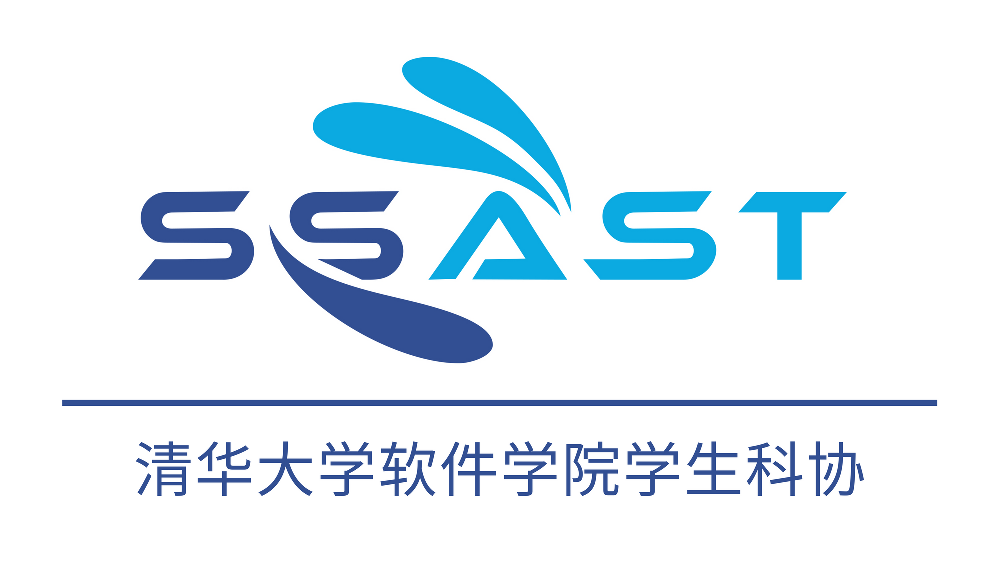
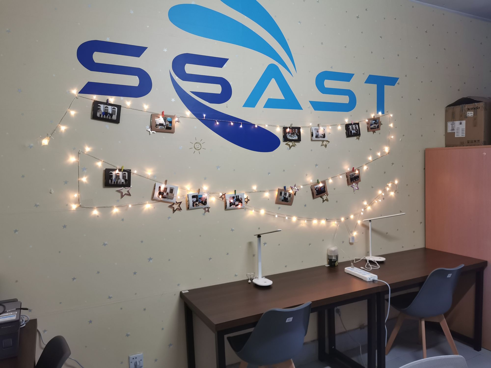
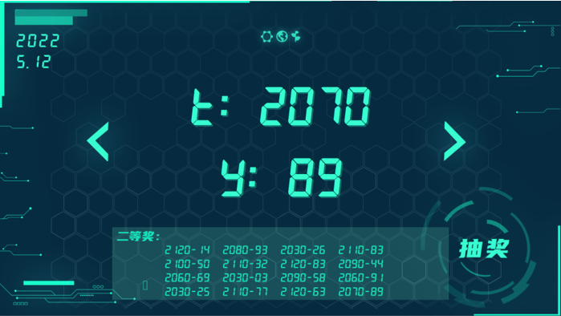
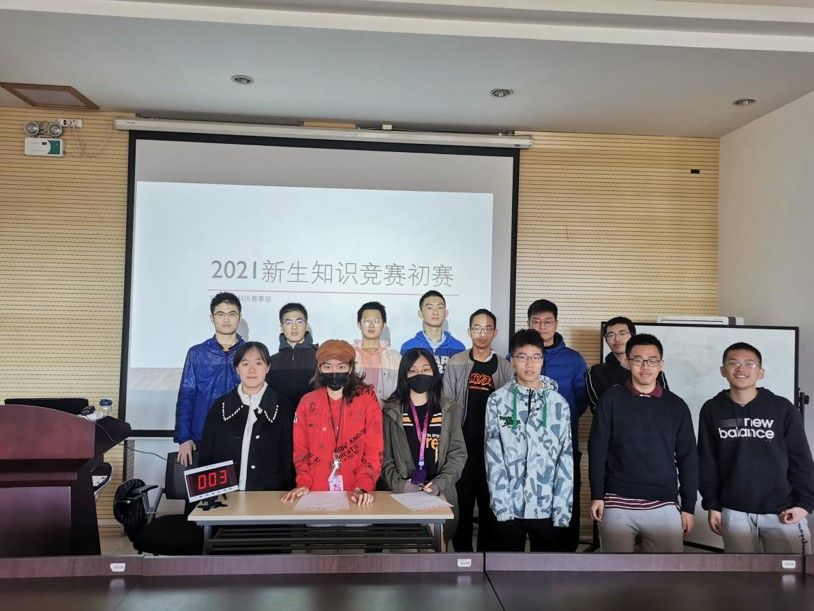
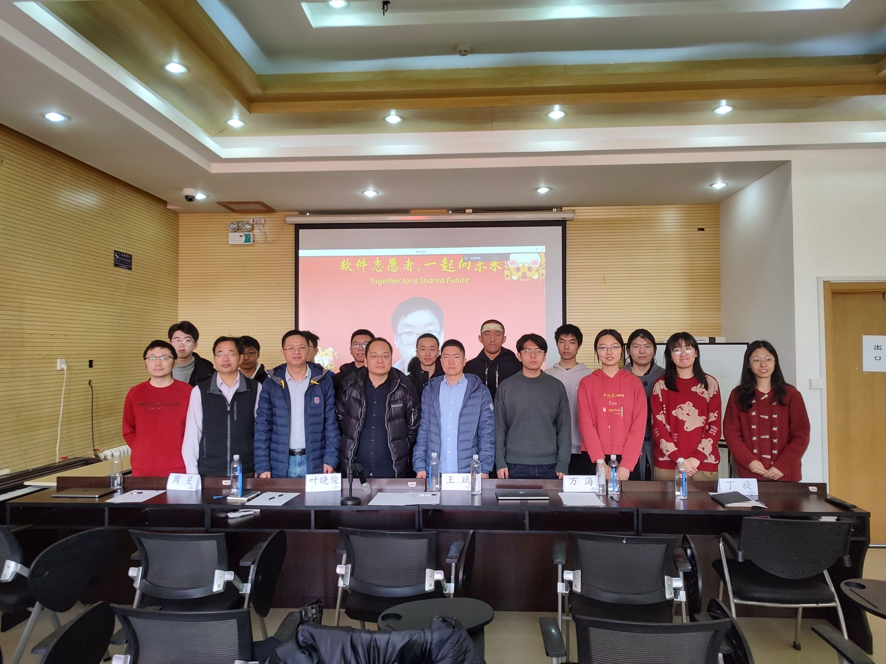

## 科协介绍

清华大学软件学院学生科学技术协会（简称为“软件学院学生科协”），是清华大学软件学院学生的科技学术组织，接受清华大学软件学院团委的指导，充分依靠软件学院广大同学开展工作。科协曾获评校级优秀学生科协。

科协的宗旨是：团结和组织全院同学，促进科学技术文化氛围的营造和繁荣，促进科技创新拔尖人才的成长和提高；反映全院同学在课外科技领域的呼声，维护全院同学在课外科技领域的权益，为全院同学服务。

科协设有常务、技术、赛事、项目四部门。四部门各司其职、相互协作。

常务部承担活动室运维和科协财务管理等各类日常事务，参与各类科创活动的宣传，负责组织团建、节日祝福等各种内联活动。

技术部主要服务于学院信息化建设，致力于解决学院各种开发需求。技术部负责维护科协服务器，联合项目部运营ReadMe互助文档项目，并以《技术茶话会》推送栏目为平台大家提供技术分享。

赛事部致力于组织和开展学生赛事，主要负责包括新生信息知识竞赛、图‧谋 GStrategy、软件创新创意大赛等各项比赛的宣传、组织与开发工作。

项目部负责科创相关工作，旨在为学院同学们搭建一个连通各方的科创资源共享平台。其主要工作包括挑战杯、SSRT计划、“科研零距离”系列推送等。

