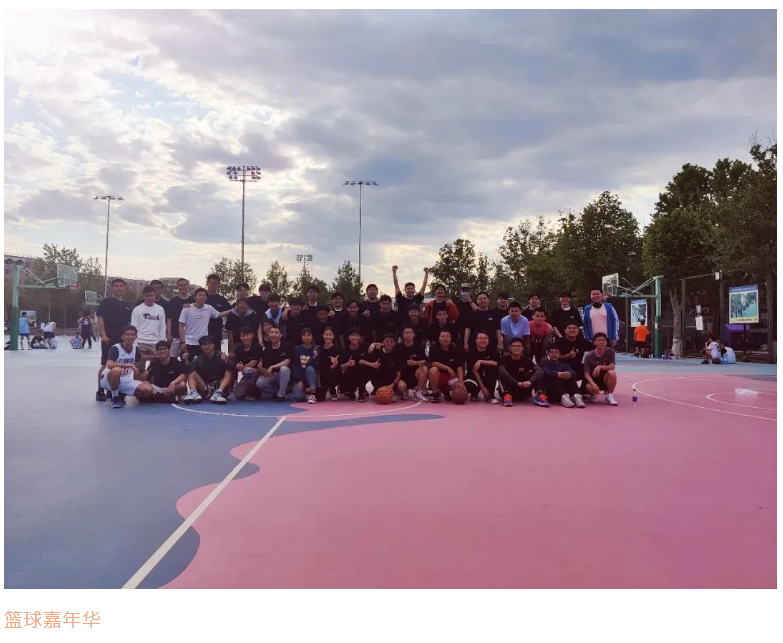
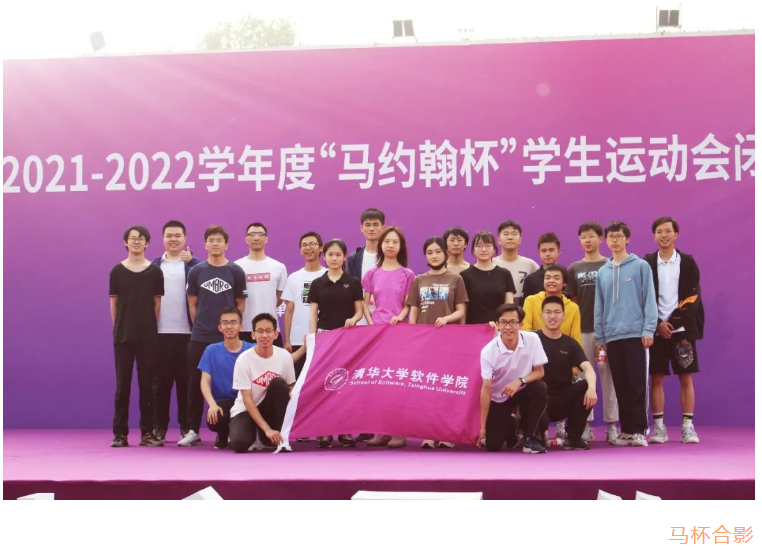
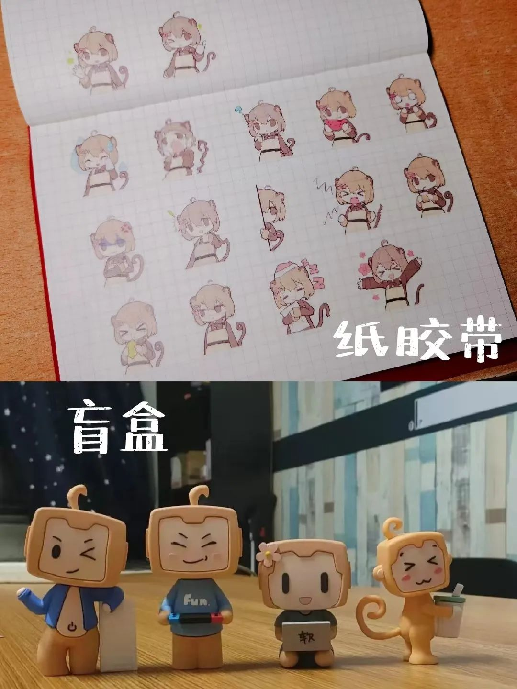
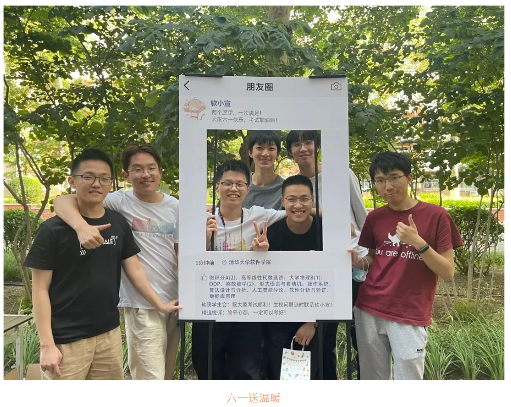
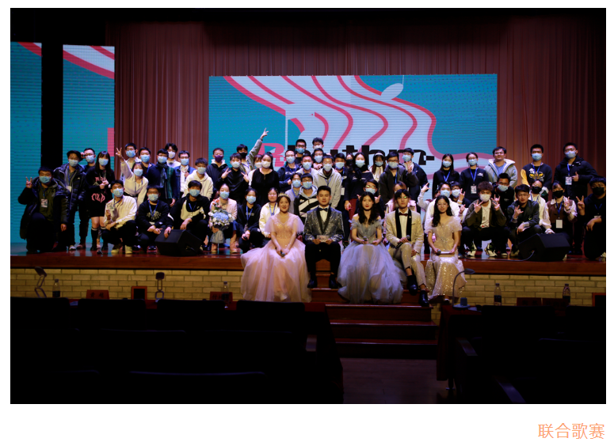
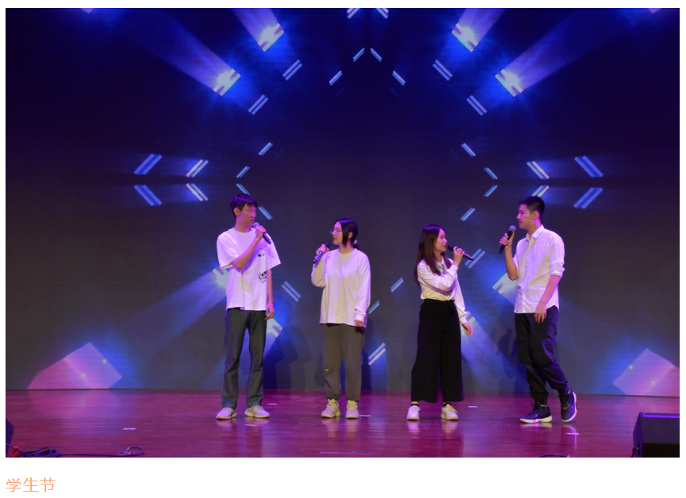
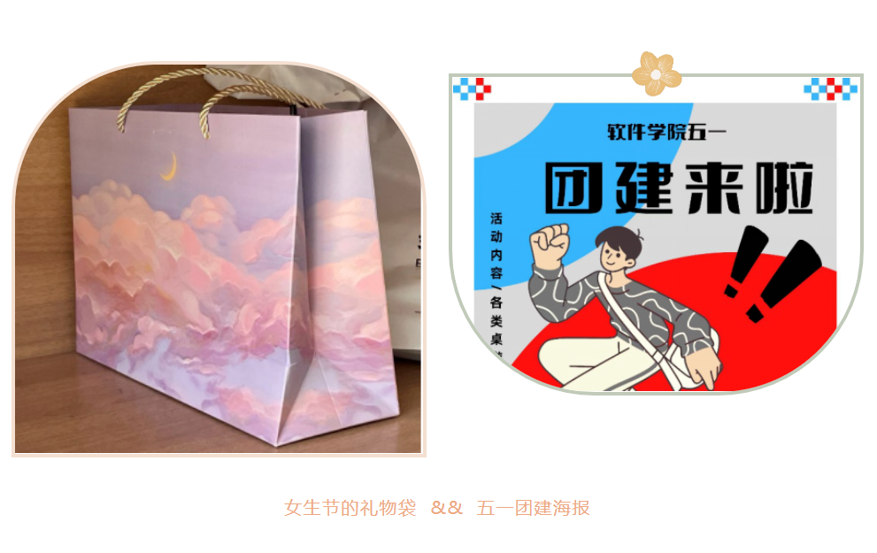
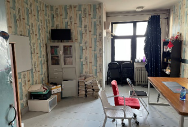

## 学生会介绍

学生会现设体育部、宣传策划部、生权发展部、文艺部和综合联络部共五个部门，这是一个温暖、有趣的大家庭。

### 体育部

“无体育，不清华”。在清华，各种体育活动都与大家息息相关，而体育部可谓软院体育最坚实的后盾。

一方面，体育部在马杯赛事中体育部为同学们提供后勤保障，助力软院体育健儿斩获各项佳绩，无论是在足球、毽球还是篮球方面软院代表队都有所突破；另一方面，体育部组织举办系内体育赛事，包括篮球嘉年华、假期电竞比赛等等，给软院同学带来快乐的同时，增强了同学们的集体荣誉感和归属感，让软院体育氛围更浓厚。

### 宣传策划部

宣传策划部始终致力于讲好软院故事，为同学们的校园生活增添色彩。我们用文字、视频等载体宣传老师同学们的想法与事迹，传播软院文化、传递软院力量。

在学生节的筹备中，从主题推送、logo海报，到主题周边、节目单设计，宣策部的创想与设计无处不在。我们将主题思想与院系特色融入到每一样宣传品中，塑造更加立体、有趣、多样的软院形象。

在其他重要活动中少不了宣策部的身影，在毕业活动中，我们为毕业生制作了纪念周边，在新春活动中，我们参与了活动的策划，为同学们准备了许多惊喜，~~在团建活动中，我们调研了海底捞的宣传模式和菜品口味。~~

### 生权发展部

生权发展部，既负责让同学们的生活更加舒适便捷，又想方设法为本院同学的成长发展助力。在这里，每一位成员都在“权心权意”的为大家服务～生权部会为大家进行新生团购、宿舍送温暖，让大家的生活更加便利！

我们服务同学，解决生权问题，发放学生福利，塑造更美好的生活。

我们开办活动，邀请前辈学霸，共享发展经验，追寻更光明的未来。

### 文艺部

软件学院学生会文艺部负责牵头操办系级的各项大型文艺活动：新生舞会、联合歌赛、学生节等。在其中，文艺部参与负责宣传推广、节目招募、节目管理、人员协调、舞台打造等多个环节，对文艺活动的大型举办起着关键作用。

除了大型活动，日常里文艺部还致力于调动同学们的文艺热情，开展了清艺软语、软小宣形象征集、新春礼包等一系列活动，有游戏设计元素这样有趣的专栏，节日贺图以及软小宣表情包的绘制。

~~文艺部部内氛围轻松，每次例会还有海量零食供部员们享用，而两位部长更是吃零食的重量级。~~

### 综合联络部

综合联络部是新成立的部门，由原来的内联部和外联小组 合并而成，顾名思义就是进行各种联络工作，也会包括一些常务性的事务。

在日常工作中，综合联络部负责组织学生会的一些会议，经常负责会议流程和物资准备的任务。在学期中的节日到来时，综合联络部会组织相关的庆祝活动，如女生节的礼物，五一假期的桌游局等等。办好这些活动可以丰富大家的生活，促进同学之间的友好氛围，在繁忙的学习之余给大家送来温暖，是很有意义的事情。

此外，综合联络部一项很重要的职责是管理学生会的活动室。管理的范围包括活动室的使用、内部物品、装饰、图书、卫生环境等等。上学期我们对活动室进行了整理并购置了新的物品。同学们共同努力为大家创造更好的学习、娱乐环境，工作虽小但也十分重要。

外联工作就是与学生之外的个人、团体、企业打交道，可以为学生会拉来赞助、获得资源，也是十分重要的事项。在外联工作中，大家可以收获宝贵的交流、工作经验，学会适应各种场合，从容应对复杂的交际情景，对个人发展而言是很好的锻炼。