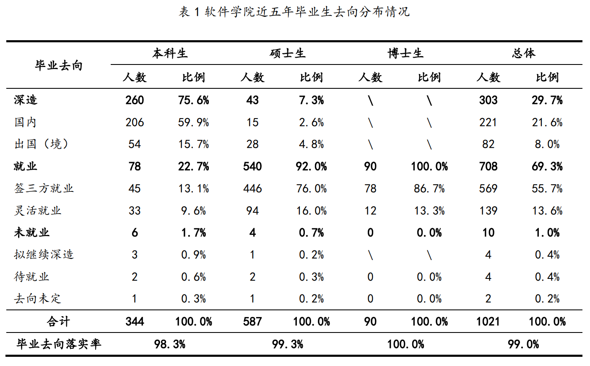
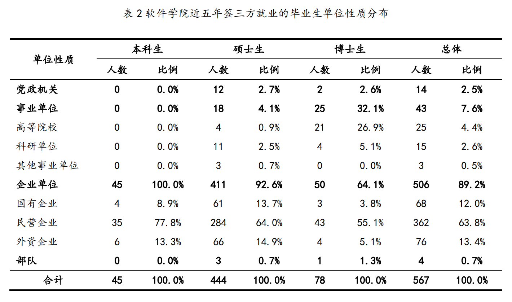
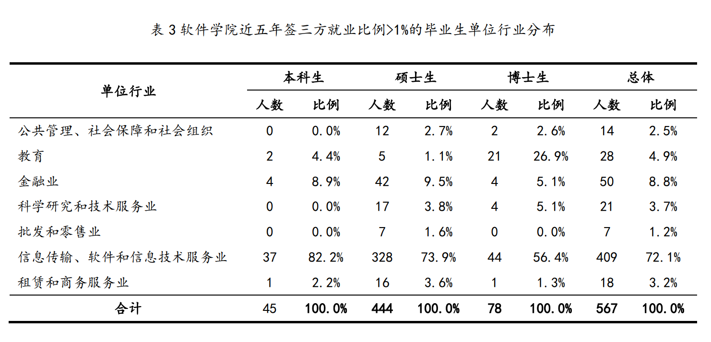
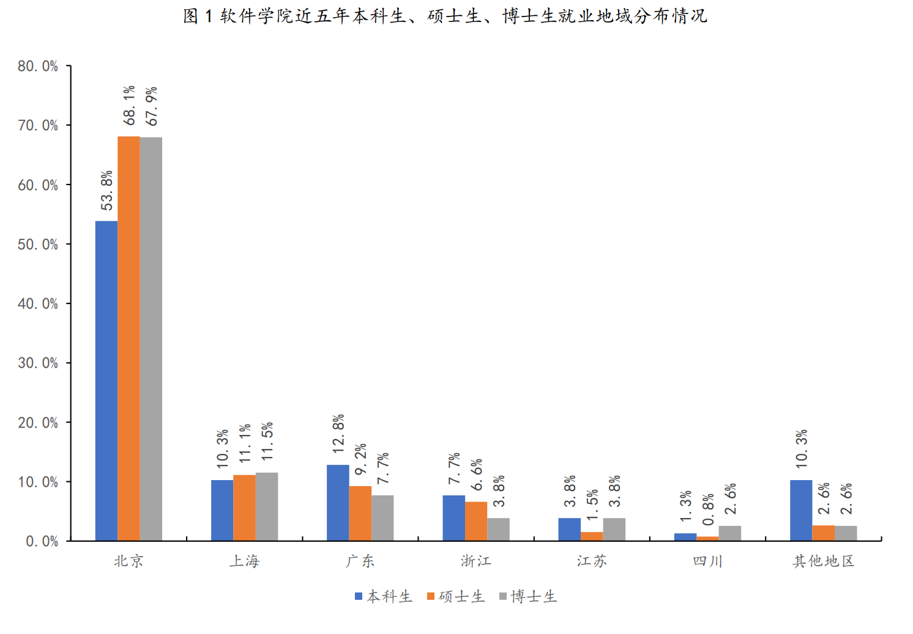
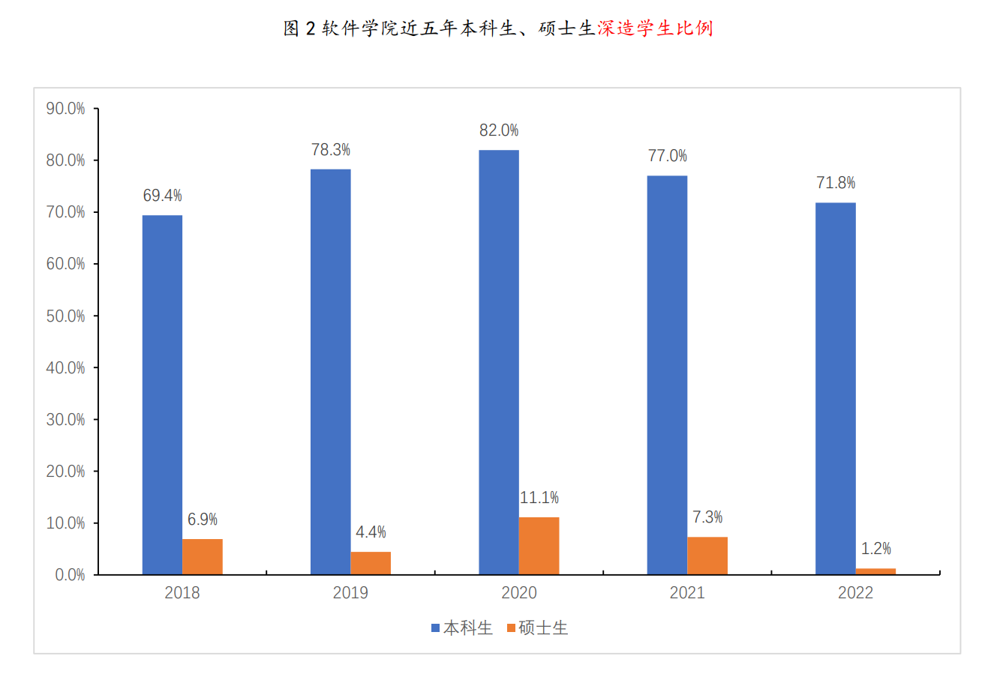
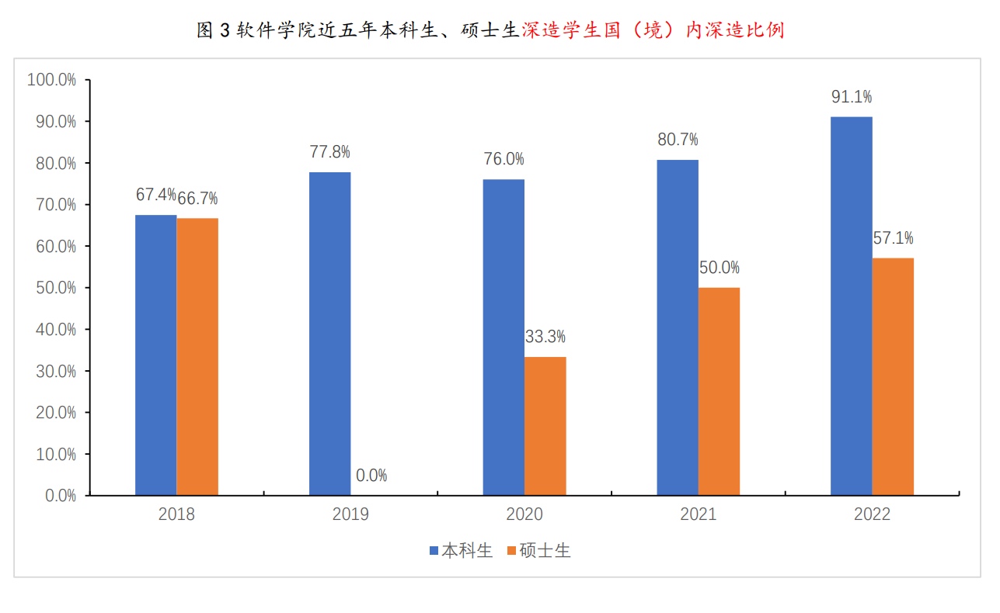

## 毕业去向

### 一、毕业去向落实率与毕业去向

毕业生毕业去向落实率是指深造和就业毕业生数量占毕业生总数的比例。其中，深造包含国内深造和出国（境）深造；就业包含签三方协议就业（以下简称“签三方就业”）和灵活就业两种形式。灵活就业包括不签署三方协议而直接与用人单位签署劳动合同就业、持有用人证明登记就业、自主创业和自由职业四种类型。

根据不完全统计，清华大学软件学院近五年毕业生毕业去向落实率为98.3%。其中，国内深造比例为21.6%，出国（境）深造比例为8.0%，签三方就业比例为55.7%，灵活就业比例为13.6%。本科、硕士和博士毕业生毕业去向落实率分别为98.3%，99.3%和100.0%（见表1）。

### 二、出国（境）深造

软件学院近五年毕业生出国（境）深造人数为82人，占毕业生总数的8.0%。毕业生出国（境）深造去向人数最多的为美国；其次为中国香港、新加坡。主要深造高校包括卡耐基梅隆大学、密歇根州立大学、南洋理工大学、加州大学-圣地亚哥、东京大学等。

### 三、就业单位性质与行业 

软件学院近五年毕业生签三方就业的单位以企业为主，达签三方就业人数的 89.2%，其中民营企业和国有企业分别占63.8%和12.0%；高等院校、科研单位和其他事业单位占比为7.6%；党政机关占比为2.5%（见表 2）。

从单位所属行业来看，毕业生就业人数较多的行业主要包括信息传输、软件和信息技术服务业，教育，公共管理、社会保障和社会组织，金融业、科学研究和技术服务业等（见表 3）。

### 四、就业地域 

软件学院近五年毕业生就业地域分布广泛。本科、硕士和博士毕业生就业地域分布情况见图 1。

### 五、就业单位分布

根据签三方就业人数的统计，接收软件学院近五年毕业生较多的单位主要分布在：信息通讯和互联网领域，如微软、腾讯、阿里巴巴、华为、字节跳动等；高等院校及科研院所，如清华大学、中国科学院等；金融业领域，如摩根士丹利、中国农业银行、中国建设银行等。

 

### 六、近五年深造学生比例

软件学院近五年毕业生毕业去向有所变化。本科、硕士毕业生深造学生比例情况见图 2，深造学生国（境）内深造比例见图 3。

